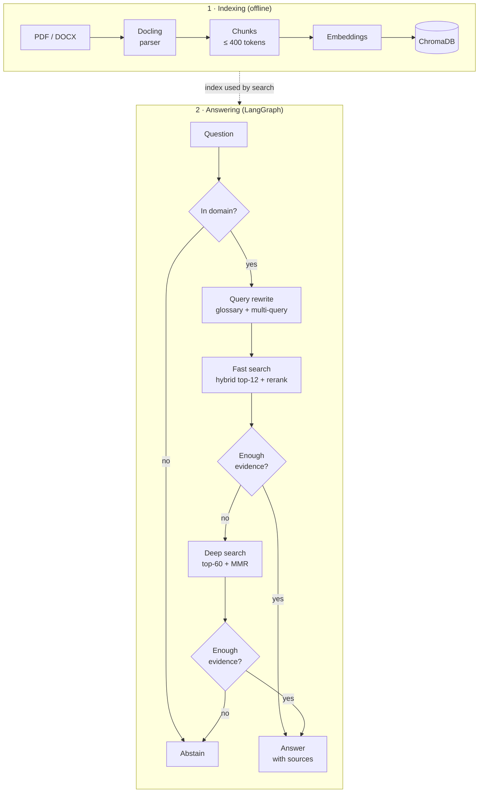

# Regulatory RAG — evidence-gated compliance Q&A

Compliance questions in a distributed organisation — is this briefing mandatory, how often,
does it apply to *this* site — need an external regulation, the unit's local act and the facts
of the object at once, and a confident unsupported answer is worse than "I don't know".
**This system answers with citations — or refuses.** The main scenario is a unit asking about
its own object; general regulatory search is a mode of the same screen.

Built by a labour- and fire-safety practitioner who builds LLM systems: the domain and the
problems come from daily compliance work.

[](https://python.org)
[](https://github.com/spqr-86/regulatory-rag/actions/workflows/ci.yml)
[](https://opensource.org/licenses/MIT)

In-scope correctness **8.09 / 10** · faithfulness **0.974** · false-sufficiency **7.1%** ·
p50 **9.5 s** · **$0.0021 / query** (56-question golden set, `gpt-4o` judge) ·
retrieval HR@5 **0.63** on 90 practitioner questions never used for tuning.

📖 [Evaluation report](./docs/evaluation/README.md) · [FACTS](./docs/reference/FACTS.md) ·
[design decisions](./docs/explanation/design-decisions.md) · [all docs](./docs/README.md) ·
[Russian README →](./README_RU.md)

---

## Demo

Screenshots of the live Streamlit UI (DeepSeek V4.1 Flash, 23.09.2026). The UI is in Russian;
the unit data is synthetic.

| General regulatory base — direct answer | General regulatory base — direct answer |
|---|---|
| [](docs/assets/demo/01-generic-internship.png) | [](docs/assets/demo/02-generic-microenterprise.png) |
| Minimum on-the-job internship length: answer citing the section of each of two sources. | Knowledge check at a micro-enterprise without a commission: yes, with the exact clause. |
| **Unit (warehouse) — `needs_context`** | **Unit (office) — `needs_context`** |
| [](docs/assets/demo/03-department-depot.png) | [](docs/assets/demo/04-department-office.png) |
| Stair test deadline depends on the last test date, which the unit sheet marks unknown — the system shows the norm and the known facts and asks for the date instead of guessing. | Extinguishers and evacuation plan depend on building headcount and room categories the sheet does not record — the answer is withheld, the missing facts are asked for. |

---

## How it works



- **No LLM routing** — every branch is a deterministic score threshold; the same query takes
  the same path twice.
- **Abstain over hallucinate** — the answer is released only after a sufficiency gate; missing
  cross-referenced clauses are pulled in before escalating ([triage](./docs/explanation/triage.md)).
- **Two-stage retrieval** — the fast path handles ~80% of questions; deep search runs only when
  the gate says the evidence is thin.

---

## Metrics

| Metric | Value | Measured on |
|---|---|---|
| Retrieval HR@5 / HR@12 / MRR (hybrid) | 0.63 / 0.81 / 0.50 | 90 practitioner questions |
| In-scope correctness | 8.09 / 10 | 43 in-scope questions (target >7.5) |
| Faithfulness | 0.974 | 56-question golden set |
| Answer relevance | 0.853 | 56-question golden set (target >0.85) |
| OOS abstain rate | 1.00 | 7 out-of-scope questions |
| False-sufficiency rate | 7.1% | simple-path answers the judge scored < 5/10 (target <10%) |
| Latency p50 / p95 | 9.5 / 25.9 s | per query, end to end |
| Cost / query | $0.0021 ($0.11 / run) | provider token usage, `src/pricing.py` rate card |

*False-sufficiency* is the share of fast-path answers the judge then scored below 5/10 — "how
often did the fast path release something weak", not a hallucination rate. Generation numbers
are judge-dependent (±0.25 run to run); denominators and the full comparison with earlier runs:
[evaluation report](./docs/evaluation/README.md).

**What the measurements showed**
([experiments](./docs/evaluation/experiments/README.md)):
- Hybrid retrieval was kept on measured grounds: BM25-only is disqualified, vector vs hybrid is
  a near-tie ([memo](./docs/evaluation/experiments/retrieval-backbones.md)).
- DeepSeek V4.1 Flash is the cheapest of six tested models to pass all four adversarial
  threshold traps ([memo](./docs/evaluation/experiments/cheap-model-selection.md)); a 5× latency
  regression it brought was traced to the provider's default reasoning effort and fixed
  ([memo](./docs/evaluation/experiments/golden-set-effort-low.md)).
- Rejected after measurement and documented: tuning `RRF_K`, 81 alternative gate threshold
  profiles, norm-to-field markup.

---

## Unit-scoped Q&A

Questions asked **by a specific unit** about its own object, answered over company-wide
legislation, the unit's local acts and the unit's object sheet. The sheet is not ranked as a
norm: it is parsed into a structured profile and passed to the prompt whole, so the answer can
quote object facts and apply a norm to them. Missing facts are asked for, not guessed.

`answered` means **"citations checked"**, not "content verified": every cited id exists, both
norm levels are present, and a deterministic gate rejects a conclusion built on a field the
sheet marks unknown. Whether the cited text supports the claim is measured in eval, not
enforced at runtime. Design: [spec](./docs/design/2026-09-14-department-qa-mvp-design.md) ·
[object profile](./docs/design/2026-09-15-object-profile-design.md) ·
[results](./docs/evaluation/experiments/department-qa-object-profile.md).

---

## Quick start

```bash
git clone https://github.com/spqr-86/regulatory-rag.git && cd regulatory-rag
python -m venv .venv && source .venv/bin/activate && pip install -r requirements.txt
cp .env.example .env            # OPENROUTER_API_KEY (LLM) + OPENAI_API_KEY (embeddings, judge)
python index.py                 # PDF/DOCX from source_docs/ → ChromaDB
streamlit run app.py --server.port 8502    # UI
uvicorn api:app --port 8503                 # REST API, docs at /docs
```

The Department screen needs its manifest and object profiles:
[getting started](./docs/getting-started.md#run-the-ui). LLM, embeddings, reranker and vector
store are swappable via `.env` ([configuration](./docs/reference/configuration.md)).

**Monitoring** (optional): `docker compose up -d` brings up Postgres + Grafana; every query
becomes a row with cost, latency, route and 👍/👎
([how-to](./docs/how-to/run-monitoring-stack.md)).

[](docs/assets/grafana-queries.png)

---

## Stack

| Layer | Technology |
|-------|-----------|
| Orchestration | LangGraph (V7 deterministic graph) |
| LLM | OpenRouter `deepseek/deepseek-v4.1-flash` (both paths); OpenAI, Gemini, DeepSeek, OpenRouter configurable per path |
| Embeddings | OpenAI text-embedding-3-small (local sentence-transformers optional) |
| Vector store | ChromaDB |
| Reranking | CrossEncoder (sentence-transformers); FlashRank selectable |
| ETL | Docling (PDF/DOCX → chunks), HybridChunker |
| Evaluation | custom LLM-as-judge (faithfulness, relevance, correctness) + IR metrics (HR@k, MRR) |
| Monitoring | Postgres + Grafana (docker compose), events written from inside the graph |
| UI | Streamlit |

---

## Limitations

- **Small samples:** out-of-scope 7 questions, Department 9, threshold traps 4 — sanity
  checks, not guarantees.
- **The judge is not independently validated** (`gpt-4o`, on the [roadmap](./docs/roadmap.md)).
- **Answer relevance only just clears its target** (0.853): it fell from 0.887 with the
  low-reasoning-effort fix that cut latency.
- **Latency is still ~2× the earlier GPT-4o-mini baseline** (p50 9.5 s vs 4.5 s).
- **`answered` checks citations, not content** — content is measured in eval.
- **Tables from Order 29н lose their header when chunked**
  ([#64](https://github.com/spqr-86/regulatory-rag/issues/64)).
- **Department queries are logged at zero cost**
  ([#66](https://github.com/spqr-86/regulatory-rag/issues/66)); 👍/👎 counts are in single digits.
- **Unit data is synthetic; the demo stand is localhost-only**, there is no public demo.

---

## Project status

Portfolio MVP complete (2026-09-21): evidence-gated pipeline, hybrid retrieval, Department
Q&A, offline evaluation and online telemetry. Deployed on a VPS as a localhost-only service.
Post-MVP backlog: [roadmap](./docs/roadmap.md) · [changelog](./CHANGELOG.md).

**Author:** Petr Baldaev — [LinkedIn](https://linkedin.com/in/petr-baldaev-b1252b263/) · [GitHub](https://github.com/spqr-86)
