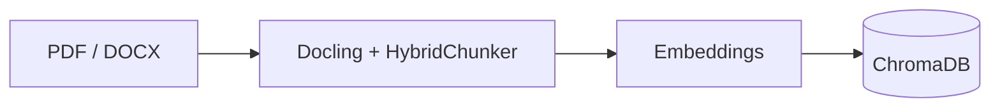
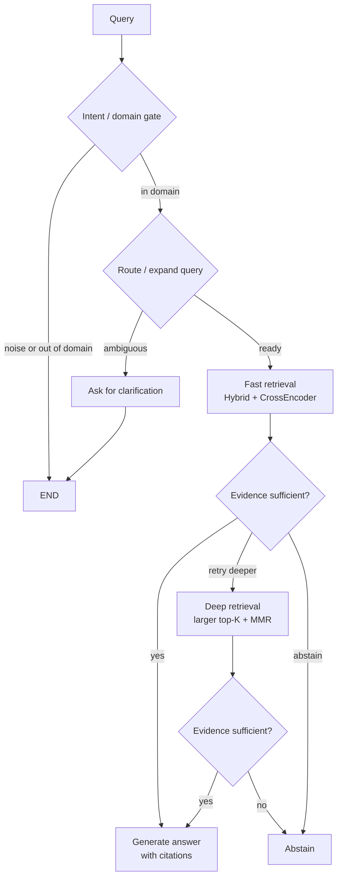

# Regulatory RAG — evidence-gated compliance Q&A

In a distributed organisation the same compliance questions come back every week: is this
briefing still mandatory, how often, and does it apply to *this* particular site. The answer
usually sits in three places at once — an external regulation (ГОСТ, СНиП, ТК РФ, fire- and
labour-safety rules), the unit's own local act, and the recorded facts of the object itself.
Manual lookup across hundreds of PDFs with dense cross-references is slow, and in compliance
a confident unsupported answer is worse than an explicit "I don't know".

**This system answers such questions with citations — or refuses.** Every routing decision is
deterministic (score thresholds, no LLM in the loop), the answer is released only when the
evidence passes a sufficiency gate, and retrieval and generation are measured separately so
that a wrong answer can be attributed to a missing chunk or to a bad decision over a good one.

[](https://python.org)
[](https://github.com/spqr-86/regulatory-rag/actions/workflows/ci.yml)
[](https://opensource.org/licenses/MIT)

**Retrieval** (90 questions taken verbatim from OT/PB practitioner forums, never used for
tuning): HR@5 **0.63** · HR@12 **0.81** · MRR **0.50**.
**Generation** (56-question golden set, `gpt-4o` judge): in-scope correctness **7.47 / 10** ·
faithfulness **0.891** · answer relevance **0.879** · **~$0.0039/query**, p50 **4.5 s**.

Two of the numbers miss their targets and are reported anyway: in-scope correctness 7.47
against a >7.5 target, and false-sufficiency 11.4% against a <10% target. Sample sizes and
what each metric actually denominates are in [Metrics](#metrics).

> Canonical values live in [docs/reference/FACTS.md](./docs/reference/FACTS.md). Design
> reasoning: [docs/explanation/design-decisions.md](./docs/explanation/design-decisions.md).
> Full methodology, per-experiment evidence and threats to validity:
> [evaluation report](./docs/evaluation/README.md).

[Russian README →](./README_RU.md)

---

## How it works

**Indexing**



**Request flow**



The diagram intentionally stays at graph level; the exact node-by-node flow and evaluator internals are in [architecture](./docs/explanation/architecture.md).

Key design decisions:
- **No LLM routing** — all branching uses deterministic score thresholds, so the same query
  takes the same path twice.
- **Abstain > hallucinate** — the system refuses when retrieval confidence is low; triage is a
  three-metric hard gate plus a structured sufficiency gap that pulls in cross-referenced
  clauses before escalating ([triage](./docs/explanation/triage.md)).
- **Two-stage retrieval** — a fast path handles most queries; the slow path (top-60 + MMR)
  activates only when the gate says the evidence is thin.

The shipped index holds 12 regulatory documents (~7.8k chunks) as an example corpus — bring
your own. Exact counts: [FACTS § corpus](./docs/reference/FACTS.md#corpus).

📖 **Docs:** [architecture](./docs/explanation/architecture.md) · [design decisions](./docs/explanation/design-decisions.md) · [evaluation report](./docs/evaluation/README.md) · [FACTS](./docs/reference/FACTS.md) · [full documentation](./docs/README.md)

---

## Metrics

| Metric | Value | Measured on |
|---|---|---|
| Retrieval HR@5 / HR@12 / MRR (hybrid) | 0.63 / 0.81 / 0.50 | 90 practitioner questions |
| In-scope correctness | 7.47 / 10 | 43 in-scope questions (target >7.5) |
| Correctness, all questions | 7.26 / 10 | 56-question golden set |
| Faithfulness | 0.891 | 56-question golden set |
| Answer relevance | 0.879 | 56-question golden set |
| OOS abstain rate | 1.00 | out-of-scope subset only — 7 questions, a small sample |
| False-sufficiency rate | 11.4% | share of simple-path answers the judge scored < 5/10 (target <10%) |
| Complex-path rate | 17% | 56-question golden set |
| Latency p50 / p95 / mean | 4.51 / 15.70 / 6.83 s | per query, end to end |
| Cost / query | $0.00387 ($0.205 / run) | provider token usage, not an estimate |

**How to read these.** The golden set is 56 questions — 43 in-scope, 7 out-of-scope, 6 with a
false premise; 53 of 56 answers were valid in the reported run. *False-sufficiency* is not a
hallucination rate and not a gate error rate: it is the share of answers released on the fast
path that the judge then scored below 5/10 (`eval/run_v7_eval.py`) — the question it answers
is "how often did the fast path release something weak". *OOS abstain* is measured on the
out-of-scope subset alone, so 1.00 rests on 7 questions and should be read as a sanity check,
not as a guarantee. All generation numbers are judge-dependent: compare runs only under the
same judge. Retrieval is measured independently (`eval/run_retrieval_eval.py`) on questions
frozen before any tuning.

---

## What the measurements showed

Retrieval and generation are measured **separately** — a single end-to-end score hides
whether a wrong answer came from a missing chunk or from a bad decision over a good chunk.
Full methodology, per-experiment memos and threats to validity:
[docs/evaluation/](./docs/evaluation/README.md).

**Retrieval backbones** (90 practitioner questions; hybrid is production):

| Backbone | HR@5 | HR@12 | MRR | p50 |
|---|---:|---:|---:|---:|
| hybrid (production) | 0.633 | 0.811 | 0.503 | 550 ms |
| vector-only | 0.589 | 0.822 | 0.486 | 148 ms |
| bm25-only | 0.500 | 0.667 | 0.352 | 24 ms |

BM25-only is disqualified; vector vs hybrid is a near-tie (hybrid wins the top-5 and MRR that
feed reranking, vector wins HR@12 and runs ~3.5× faster). Hybrid kept on measured grounds,
not on "best practice" ([memo](./docs/evaluation/experiments/retrieval-backbones.md)).

**Department Q&A — object sheet as a profile (`v2`) vs in the index (`v1`)** (9 questions,
expectations committed before the run, `gpt-4o-mini`):

| Metric | v1 | v2 |
|---|---:|---:|
| Expected status + reasons | 7/9 | 8/9 |
| Required sub-answers credited | 7/17 | 11/17 |
| Forbidden conclusions | 2 | 1 |

Hypothesis, pre-committed expectations, controlled comparison, failure analysis, architecture
change. The remaining `v2` error is a norm threshold applied to a fact of the wrong quantity;
it survived prompt iterations, a typed object sheet and a post-generation verifier, and was
only fixed by the model
([memo](./docs/evaluation/experiments/department-qa-object-profile.md)).

**Cheap-model selection on 4 adversarial threshold traps** (mode `v2`, one run per model):

| Model | Traps passed | Cost, 4 q |
|---|---:|---:|
| `deepseek/deepseek-v4.1-flash` | **4/4** | $0.022 |
| `openai/gpt-5-mini` | 4/4 | $0.049 |
| `google/gemini-3-flash-preview` | 4/4 | $0.030 |
| `openai/gpt-4o-mini` | 2/4 | $0.004 |
| `anthropic/claude-haiku-4.5` | 2/4 | $0.057 |
| `deepseek/deepseek-v4-flash` | 1–1.5/4 | $0.003 |

DeepSeek V4.1 Flash is the cheapest model that passed all traps and is the showcase default.
The contract status did not separate correct from wrong answers — models were compared on
semantics ([memo](./docs/evaluation/experiments/cheap-model-selection.md)).

Rejected after measurement: tuning `RRF_K` (dead knob), a different hard-gate threshold
profile (81 profiles, none safer), norm-to-field markup. Negative results are documented, not
hidden: [experiments/](./docs/evaluation/experiments/).

---

## Department Q&A

A second product line on the same retrieval core: questions asked **by a specific unit**
about its own object, answered over two norm levels — company-wide legislation (`external`)
and the unit's own local acts (`internal`) — plus a third evidence level, the unit's object
sheet. Vertical slice on a synthetic corpus, limits documented.

The sheet is not a norm to be ranked: it is parsed into a structured **object profile** and
passed to the prompt whole (`DEPARTMENT_QA_MODE=v2`, default), instead of being indexed as
ordinary chunks (`v1`). The answer schema adds `object_facts` (facts quoted from the sheet)
and `applied_conclusions` (an object fact plus the norm applied to it) to the existing answer
contract.

`answered` means **"citations checked"**, not "content verified": every cited id exists with
the right role, no clarifying question is pending, both norm levels are present, a cited
profile carries a fill-in date, and a deterministic gate rejects an applied conclusion that
cites a field the sheet marks `unknown`. Whether the cited text actually supports the claim is
measured in eval, not enforced at runtime — and the UI says so.

- Specs: [department Q&A MVP](./docs/superpowers/specs/2026-09-14-department-qa-mvp-design.md) · [object profile](./docs/superpowers/specs/2026-09-15-object-profile-design.md)
- Mode, env and guarantee boundary: [FACTS § department qa](./docs/reference/FACTS.md#department-qa)
- Results and known error: [evaluation report](./docs/evaluation/README.md)

---

## Quick start

```bash
git clone https://github.com/spqr-86/regulatory-rag.git
cd regulatory-rag
python -m venv .venv && source .venv/bin/activate
pip install -r requirements.txt
cp .env.example .env  # fill OPENAI_API_KEY (embeddings, complex path, judge) + OPENROUTER_API_KEY (simple path)
```

Drop your PDF/DOCX regulatory documents into `source_docs/`, then:

```bash
python index.py                 # index documents → ChromaDB (rebuilds the collection; the old index is removed only after chunking succeeds)
streamlit run app.py --server.port 8502   # UI at http://localhost:8502
uvicorn api:app --port 8503                # REST API at http://localhost:8503/docs
```

Defaults: ChromaDB, OpenAI embeddings, and a two-provider LLM split (OpenRouter on the simple
path, OpenAI on the complex path). Every layer — LLM, embeddings, reranker, vector store — is
swappable via `.env`, and the glossary, prompts and corpus are what you change to move the
system to another domain: [configuration reference](./docs/reference/configuration.md).

**Monitoring** (optional): `docker compose up -d` brings up Postgres + Grafana; with
`V7_TELEMETRY_WRITER=postgres` every query becomes a row (cost, latency, route, tokens,
`source`) and the dashboard *Regulatory RAG — запросы* at `http://localhost:3000/d/regrag-queries`
shows cost, 👍/👎 rate, routes and p50/p95. Without the stack nothing breaks: events go to
`logs/events.jsonl` and can be replayed later. Setup, ports and troubleshooting:
[how-to/run-monitoring-stack.md](./docs/how-to/run-monitoring-stack.md).

**REST API:** `POST /query` (full pipeline), `POST /retrieve` (retrieval only, no LLM),
`GET /corpus`, `GET /health`. Request/response shapes, examples and rate limits:
[reference/api.md](./docs/reference/api.md); interactive docs at `http://localhost:8503/docs`.

---

## Stack

| Layer | Technology |
|-------|-----------|
| Orchestration | LangGraph (V7 deterministic graph) |
| LLM | OpenRouter `deepseek/deepseek-v4.1-flash` (simple) + OpenAI `gpt-4o` (complex); OpenAI, Gemini, DeepSeek, OpenRouter configurable per path |
| Embeddings | OpenAI text-embedding-3-small (local sentence-transformers optional) |
| Vector store | ChromaDB |
| Reranking | CrossEncoder (sentence-transformers); FlashRank selectable |
| ETL | Docling (PDF/DOCX → chunks), HybridChunker |
| Evaluation | custom LLM-as-judge (faithfulness, relevance, correctness) + IR metrics (HR@k, MRR) |
| Monitoring | Postgres + Grafana (docker compose), events written from inside the graph |
| UI | Streamlit |

---

## Project status

**Portfolio MVP complete (2026-09-11).** Built:

- **Evidence-gated LangGraph pipeline** — deterministic routing, three-metric sufficiency
  gate, structured triage gap, explicit abstention
- **Hybrid retrieval** — BM25 + vectors, CrossEncoder rerank, two-stage, with
  cross-reference expansion and glossary/multi-query expansion
- **Object-aware compliance mode** — Department Q&A over external + internal norms and a
  typed object profile, with deterministic citation and unknown-field gates
- **Offline evaluation** — golden set + a 90-question practitioner retrieval set, separate
  retrieval and generation measurement, per-query cost and latency, negative results kept
- **Online telemetry** — every query a row in Postgres, Grafana dashboard, 👍/👎 feedback;
  the whole stack is one `docker compose up`

Deployed on a VPS (Streamlit, port 8502). The full shipped-capability checklist and the
optional post-MVP backlog (independent judge validation, error attribution between retrieval
and generation, a chunking experiment for tables and headers) are in
[docs/roadmap.md](./docs/roadmap.md); results, rejected variants and threats to validity are
in the [evaluation report](./docs/evaluation/README.md).

---

**Author:** Petr Baldaev — [LinkedIn](https://linkedin.com/in/petr-baldaev-b1252b263/) · [GitHub](https://github.com/spqr-86)

[Changelog →](./CHANGELOG.md)
