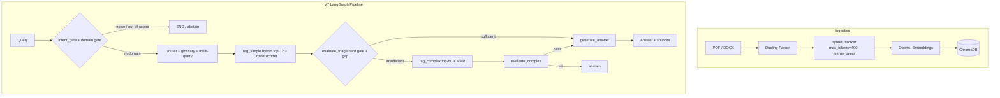

# Regulatory Compliance RAG

**RAG pipeline for Russian regulatory documents (ГОСТ, СНиП, Trudovoy Kodeks, fire-safety and labour-safety rules) — answers questions with citations or explicitly abstains when uncertain.**

[](https://python.org)
[](https://github.com/spqr-86/regulatory-rag/actions/workflows/ci.yml)
[](https://opensource.org/licenses/MIT)

**Answer quality** (56-question golden set, `gpt-4o` judge): in-scope correctness **7.47 / 10** · faithfulness **0.891** · answer relevance **0.879** · OOS rejection **1.00** · false-sufficiency **11.4%** · complex-path **17%** · **~$0.0039/query**, p50 **4.5 s**.

> Metrics are judge-dependent — canonical values live in [docs/reference/FACTS.md](./docs/reference/FACTS.md). The reasoning behind the architecture is in [docs/explanation/design-decisions.md](./docs/explanation/design-decisions.md).

[Russian README →](./README_RU.md)

---

## The problem

Regulatory documents in industrial domains (workplace safety, fire safety, construction) span hundreds of PDFs with dense cross-references. Manual lookup is slow and error-prone. A hallucinated answer to a compliance question isn't a UX issue — it's a liability.

This project explores how far RAG + deterministic guardrails can go toward reliable Q&A over regulatory corpora.

---

## How it works

```
User query
    ↓
intent_gate          — regex noise filter + (optional) cosine-to-centroid OOS gate, before retrieval
    ↓
router               — query plan + glossary expansion + multi-query (RRF merge)
    ↓
rag_simple           — hybrid retrieval (BM25 + vectors, top-12) + CrossEncoder rerank
    ↓
evaluate_triage      — deterministic sufficiency gate (no LLM scoring)
    ├── sufficient    → generate_answer
    └── insufficient  → rag_complex (top-60 + MMR) → evaluate_complex
                            ├── pass  → generate_answer
                            └── fail  → abstain (explicit refusal)
```

Key design decisions:
- **No LLM routing** — all branching decisions use deterministic score thresholds
- **Abstain > hallucinate** — the system refuses to answer when retrieval confidence is low
- **Two-stage retrieval** — a fast path handles most queries; the slow path activates only when needed

Triage is a single deterministic path: a three-metric hard gate plus a structured
sufficiency gap that pulls in cross-referenced clauses before escalating. See
[docs/explanation/triage.md](./docs/explanation/triage.md).

📖 **Docs:** [architecture](./docs/explanation/architecture.md) · [design decisions](./docs/explanation/design-decisions.md) · [evaluation report](./docs/evaluation/README.md) · [FACTS](./docs/reference/FACTS.md) · [full documentation](./docs/README.md)

---

## Metrics

| Metric | Value |
|---|---|
| In-scope correctness | 7.47 / 10 |
| Correctness (all questions) | 7.26 / 10 |
| Faithfulness | 0.891 |
| Answer relevance | 0.879 |
| OOS rejection rate | 1.00 |
| False-sufficiency rate | 11.4% |
| Complex-path rate | 17% |
| Latency p50 / p95 / mean | 4.51 / 15.70 / 6.83 s |
| Cost / query | $0.00387 ($0.205 / run) |
| Retrieval HR@5 / HR@12 / MRR (hybrid, 90 practitioner questions) | 0.63 / 0.81 / 0.50 |

Eval: 56-question golden dataset (`tests/dataset.csv`), `eval/run_v7_eval.py`, LLM judge
`gpt-4o`. Numbers are judge-dependent — compare runs only under the same judge. Retrieval
Hit Rate / MRR are measured separately on a 90-question test set of real questions taken
verbatim from OT/PB practitioner forums, kept only where a corpus answer exists and not
used for any tuning (`eval/run_retrieval_eval.py`); see [docs/roadmap.md](./docs/roadmap.md).
Canonical values: [docs/reference/FACTS.md](./docs/reference/FACTS.md).

---

## What the measurements showed

Retrieval and generation are measured **separately** — a single end-to-end score hides
whether a wrong answer came from a missing chunk or from a bad decision over a good chunk.
Full methodology, per-experiment memos and threats to validity:
[docs/evaluation/](./docs/evaluation/README.md).

**Retrieval backbones** (90 practitioner questions; hybrid is production):

| Backbone | HR@5 | HR@12 | MRR | p50 |
|---|---:|---:|---:|---:|
| hybrid (production) | 0.633 | 0.811 | 0.503 | 550 ms |
| vector-only | 0.589 | 0.822 | 0.486 | 148 ms |
| bm25-only | 0.500 | 0.667 | 0.352 | 24 ms |

BM25-only is disqualified; vector vs hybrid is a near-tie (hybrid wins the top-5 and MRR that
feed reranking, vector wins HR@12 and runs ~3.5× faster). Hybrid kept on measured grounds,
not on "best practice" ([memo](./docs/evaluation/experiments/retrieval-backbones.md)).

**Department Q&A — object sheet as a profile (`v2`) vs in the index (`v1`)** (9 questions,
expectations committed before the run, `gpt-4o-mini`):

| Metric | v1 | v2 |
|---|---:|---:|
| Expected status + reasons | 7/9 | 8/9 |
| Required sub-answers credited | 7/17 | 11/17 |
| Forbidden conclusions | 2 | 1 |

The remaining `v2` error is a norm threshold applied to a fact of the wrong quantity; it
survived prompt iterations, a typed object sheet and a post-generation verifier, and was only
fixed by the model
([memo](./docs/evaluation/experiments/department-qa-object-profile.md)).

**Cheap-model selection on 4 adversarial threshold traps** (mode `v2`, one run per model):

| Model | Traps passed | Cost, 4 q |
|---|---:|---:|
| `deepseek/deepseek-v4.1-flash` | **4/4** | $0.022 |
| `openai/gpt-5-mini` | 4/4 | $0.049 |
| `google/gemini-3-flash-preview` | 4/4 | $0.030 |
| `openai/gpt-4o-mini` | 2/4 | $0.004 |
| `anthropic/claude-haiku-4.5` | 2/4 | $0.057 |
| `deepseek/deepseek-v4-flash` | 1–1.5/4 | $0.003 |

DeepSeek V4.1 Flash is the cheapest model that passed all traps and is the showcase default.
The contract status did not separate correct from wrong answers — models were compared on
semantics ([memo](./docs/evaluation/experiments/cheap-model-selection.md)).

Rejected after measurement: tuning `RRF_K` (dead knob), a different hard-gate threshold
profile (81 profiles, none safer), norm-to-field markup. Negative results are documented, not
hidden: [experiments/](./docs/evaluation/experiments/).

---

## Quick start

```bash
git clone https://github.com/spqr-86/regulatory-rag.git
cd regulatory-rag
python -m venv .venv && source .venv/bin/activate
pip install -r requirements.txt
cp .env.example .env  # fill OPENAI_API_KEY (embeddings, complex path, judge) + OPENROUTER_API_KEY (simple path)
```

Drop your PDF/DOCX regulatory documents into `source_docs/`, then:

```bash
python index.py                 # index documents → ChromaDB (rebuilds the collection; the old index is removed only after chunking succeeds)
streamlit run app.py --server.port 8502   # UI at http://localhost:8502
uvicorn api:app --port 8503                # REST API at http://localhost:8503/docs
```

Defaults to ChromaDB, OpenAI embeddings, and a two-provider LLM split (OpenRouter on the simple path, OpenAI on the complex path). See [Backend abstraction](#backend-abstraction) to swap any layer via `.env`.

Optional monitoring stack (Postgres for query events, Grafana on top):

```bash
cp .env.example .env              # set POSTGRES_PASSWORD and GF_SECURITY_ADMIN_PASSWORD
docker compose up -d              # both services healthy; schema applied by db/migrations on an empty volume
V7_TELEMETRY_WRITER=postgres      # in .env: write query events to the stack instead of JSONL
```

**Where to look:** dashboard *Regulatory RAG — запросы* at
`http://localhost:3000/d/regrag-queries` (login from `.env`) — cost for the period, 👎 rate,
queries per day split by `source`, routes, cost and latency at p50/p95, and the latest 👎
with the question behind each one.

**Where to click:** under every Streamlit answer there are 👍/👎 buttons (a 👎 opens an
optional comment box). One vote per answer — pressing again overwrites the row, so the
panels count answers, not clicks. Without the stack the buttons are hidden: a vote would
have nowhere to land.

**If Postgres is not up:** nothing breaks. Answers keep working, events go to the
`logs/events.jsonl` journal — also when the database dies mid-flight — and
`python scripts/ingest_events.py logs/events.jsonl` replays them into the table once it is
back (idempotent by `query_id`). Port conflicts, a volume with an old password, empty
panels: [docs/how-to/run-monitoring-stack.md](./docs/how-to/run-monitoring-stack.md),
section «Если стек не поднялся».

---

## Architecture



The shipped index holds 12 regulatory documents (~7.8k chunks). It is an example corpus —
bring your own documents. Exact counts: [docs/reference/FACTS.md](./docs/reference/FACTS.md#corpus).

---

## Department Q&A

A second product line on the same retrieval core: questions asked **by a specific unit**
about its own object, answered over two norm levels — company-wide legislation (`external`)
and the unit's own local acts (`internal`) — plus a third evidence level, the unit's object
sheet.

The sheet is not a norm to be ranked: it is parsed into a structured **object profile** and
passed to the prompt whole (`DEPARTMENT_QA_MODE=v2`, default), instead of being indexed as
ordinary chunks (`v1`). The answer schema adds `object_facts` (facts quoted from the sheet)
and `applied_conclusions` (an object fact plus the norm applied to it) to the existing answer
contract.

`answered` means **"citations checked"**, not "content verified": every cited id exists with
the right role, no clarifying question is pending, both norm levels are present, a cited
profile carries a fill-in date, and a deterministic gate rejects an applied conclusion that
cites a field the sheet marks `unknown`. Whether the cited text actually supports the claim is
measured in eval, not enforced at runtime — and the UI says so.

- Specs: [department Q&A MVP](./docs/superpowers/specs/2026-09-14-department-qa-mvp-design.md) · [object profile](./docs/superpowers/specs/2026-09-15-object-profile-design.md)
- Mode, env and guarantee boundary: [FACTS § department qa](./docs/reference/FACTS.md#department-qa)
- Results and known error: [evaluation report](./docs/evaluation/README.md)

---

## REST API

Run the FastAPI backend alongside Streamlit:

```bash
uvicorn api:app --port 8503
```

**`POST /query`** — main RAG pipeline

```bash
curl -X POST http://localhost:8503/query \
  -H "Content-Type: application/json" \
  -d '{"question": "Как часто проводится повторный инструктаж?"}'
```

```json
{
  "answer": "Повторный инструктаж проводится не реже одного раза в 6 месяцев...",
  "passages": [{"text": "...", "source": "2464.pdf", "score": 0.91}],
  "path": "rag_simple → evaluate_triage → generate_answer → END",
  "elapsed_sec": 4.2
}
```

**`POST /retrieve`** — retrieval only (hybrid search, no LLM); **`GET /corpus`** — indexed
documents; **`GET /health`** — liveness (`{"status": "ok"}`).

Full reference with request/response shapes and rate limits:
[docs/reference/api.md](./docs/reference/api.md). Interactive docs: `http://localhost:8503/docs`.

---

## Stack

| Layer | Technology |
|-------|-----------|
| Orchestration | LangGraph (V7 deterministic graph) |
| LLM | Showcase default: OpenRouter `deepseek/deepseek-v4.1-flash` (simple) + OpenAI `gpt-4o` (complex). Also OpenAI, Gemini, DeepSeek, OpenRouter — configurable per path via `SIMPLE/COMPLEX_LLM_PROVIDER` in `.env` |
| Embeddings | OpenAI text-embedding-3-small |
| Vector store | ChromaDB |
| Reranking | CrossEncoder (sentence-transformers); FlashRank selectable via `RERANKER_BACKEND` |
| ETL | Docling (PDF/DOCX → chunks) |
| Evaluation | custom LLM-as-judge (faithfulness, answer relevance, correctness) + IR metrics (Hit Rate@k, MRR) |
| Monitoring | Postgres + Grafana (docker compose), events written from inside the graph |
| UI | Streamlit |

---

## Backend abstraction

LLM and vector store are accessed through factory layers (`src/infra/llm_factory.py`, `src/backends/`). Adding a new provider is one function plus one registry entry — pipeline code does not change.

| Layer | Shipped | Configurable via | Roadmap |
|-------|---------|------------------|---------|
| LLM   | OpenAI, Gemini, DeepSeek, OpenRouter | `SIMPLE_LLM_PROVIDER` / `COMPLEX_LLM_PROVIDER` | Anthropic |
| Vector store | Chroma | `VECTOR_STORE` | Qdrant, pgvector |
| Embeddings | OpenAI, local (sentence-transformers), hf_api | `EMBEDDING_PROVIDER` | — |

**Fully local embeddings** (LLM still over an API):
```bash
EMBEDDING_PROVIDER=local
EMBEDDING_MODEL_NAME=ai-forever/sbert_large_nlu_ru
```

**Adding a new LLM provider** (example: Anthropic):
1. Add `_create_anthropic_llm(**kwargs)` to `src/infra/llm_factory.py`
2. Register it in `_LLM_PROVIDERS = {..., "anthropic": _create_anthropic_llm}`
3. Set `SIMPLE_LLM_PROVIDER=anthropic` (and/or `COMPLEX_LLM_PROVIDER`) in `.env`

Same pattern for vector stores — implement the `VectorStoreBackend` protocol in `src/backends/`, register it in the factory.

---

## Adapting to your domain

The system ships tuned for Russian regulatory documents, but domain-specific knowledge is isolated and easy to swap.

**Term glossary** (`config/term_glossary.yaml`) — maps informal abbreviations to their official full names so BM25 and vector search can match indexed text. To extend:

```yaml
terms:
  "your abbreviation":
    official: "Full official term from your documents"
    source: "Regulation / standard reference (optional)"
```

No code changes needed — edit the YAML and restart.

**Prompts** (`prompts/`) — Jinja2 templates via `PromptManager`, versioned. Switch the active version via `prompts/registry.yaml`.

**Corpus** — drop your PDFs into `source_docs/` and run `python index.py`. The chunker and embeddings are language-agnostic.

---

## Project status

**Portfolio MVP complete (2026-09-11).** The deployed application, offline evaluation,
terminal triage contract, per-query cost accounting, and online monitoring form the
finished showcase scope. Remaining ideas are optional post-MVP experiments, not release
blockers.

- ✅ V7 LangGraph pipeline — all nodes, deterministic routing (verifier/rewriter retired — insufficient triage routes straight to rag_complex)
- ✅ Hybrid retrieval — BM25 + semantic, two-stage (simple/complex path)
- ✅ Deterministic sufficiency gate — three-metric hard gate, no LLM decisions in routing
- ✅ Structured triage gap — triage emits a typed gap and closes it by tail-append before escalating (issue #13)
- ✅ Domain gate — optional pre-retrieval OOS filter via cosine similarity to corpus centroid
- ✅ HybridChunker — structure-aware chunking aligned to document sections/articles
- ✅ Contextual embedding — parent-section heading prepended to each chunk vector
- ✅ Cross-reference expansion — auto-fetches referenced clauses (e.g. "пункт 46") from the same source
- ✅ Multi-query expansion — LLM generates query variants, RRF merge
- ✅ Versioned prompts — Jinja2 templates, registry trimmed to 3 live families; `generate_answer` v8 (anti-sycophancy + value↔condition binding)
- ✅ Offline eval — golden dataset + 90-question practitioner retrieval test set, per-query cost and latency
- ✅ Online monitoring — every query is a row in Postgres (cost, latency, route, tokens, `source`), Grafana dashboard, 👍/👎 under the answer; the whole stack is one `docker compose up`
- ✅ Department Q&A — separate stack for unit-scoped questions over company/internal norms plus a structured object profile; typed object sheet, deterministic citation and unknown-field gates; `v2` default
- ✅ Deployed on a VPS (port 8502, Streamlit)

Optional post-MVP backlog: independent judge validation, generated comparison tables,
error attribution between retrieval and generation, and a chunking experiment for tables
and section headers. See [docs/roadmap.md](./docs/roadmap.md); results to date, rejected
variants and threats to validity are in the [evaluation report](./docs/evaluation/README.md).

---

**Author:** Petr Baldaev — [LinkedIn](https://linkedin.com/in/petr-baldaev-b1252b263/) · [GitHub](https://github.com/spqr-86)

[Changelog →](./CHANGELOG.md)
