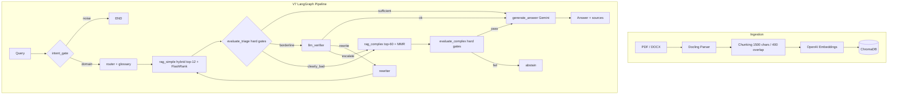

# Regulatory Compliance RAG

**Production RAG pipeline for Russian regulatory documents (GOST, SNiP, Labour Code) — answers questions with citations or explicitly abstains when uncertain.**

[](https://python.org)
[](https://github.com/spqr-86/safety-incident-analyzer/actions)
[](https://opensource.org/licenses/MIT)

**Correctness: 7.9/10 · Faithfulness: 0.988 · Cost: $0.01/query**

[Russian README →](./README_RU.md)

---

## The problem

Regulatory documents in industrial domains (workplace safety, water treatment, construction) span hundreds of PDFs with cross-references. Manual lookup is slow and error-prone. A hallucinated answer to a compliance question isn't a UX issue — it's a liability.

This project explores how far RAG + deterministic guardrails can go toward reliable Q&A over regulatory corpora.

---

## How it works

```
User query
    ↓
intent_gate          — regex filter, drops noise before retrieval
    ↓
router               — query plan + domain glossary expansion
    ↓
rag_simple           — hybrid retrieval (BM25 + vectors, top-12) + FlashRank rerank
    ↓
evaluate_triage      — deterministic hard gates (no LLM scoring)
    ├── sufficient   → generate_answer (Gemini, thinking_budget=4096)
    ├── borderline   → llm_verifier → rewrite → rag_simple (one retry)
    └── clearly_bad  → rag_complex (top-60 + MMR) → evaluate_complex
                            ├── pass  → generate_answer
                            └── fail  → abstain (explicit refusal)
```

Key design decisions:
- **No LLM routing** — all branching decisions use deterministic score thresholds
- **Abstain > hallucinate** — system refuses to answer when retrieval confidence is low
- **Two-stage retrieval** — fast path handles most queries; slow path activates only when needed

---

## Metrics

| Metric | Value | Target |
|--------|-------|--------|
| Correctness (LLM-as-judge, 0–10) | **7.9** | > 7.5 |
| Faithfulness (no hallucinations) | **0.988** | > 0.85 |
| Answer Relevance | **0.85+** | > 0.85 |
| False-sufficiency rate | **15%** | < 10% |
| Cost per query | **$0.0102** | — |
| Avg latency | 21.9 sec | — |

Eval: 50-question golden dataset, `eval/run_v7_eval.py`. LLM judge: Gemini 2.5 Flash.

---

## Quick start

```bash
git clone https://github.com/spqr-86/safety-incident-analyzer.git
cd safety-incident-analyzer
pip install -r requirements.txt
cp .env.example .env  # add GEMINI_API_KEY (LLM) + OPENAI_API_KEY (embeddings)
```

Drop your PDF/DOCX regulatory documents into `source_docs/`, then:

```bash
python index.py        # index documents → ChromaDB
streamlit run app.py   # UI at http://localhost:8501
uvicorn api:app --port 8503  # REST API at http://localhost:8503/docs
```

Defaults to Gemini + Chroma + OpenAI embeddings. See [Backend abstraction](#backend-abstraction) to swap any layer via `.env`.

---

## Architecture



### GOST corpus (separate index)

108 GOST/SNiP documents → **9,344 chunks** in ChromaDB collection `wta_gosts` (example corpus, not included in repo — bring your own documents).
API endpoint: `POST /query/gosts`. Generation: DeepSeek V3.

---

## REST API

Run the FastAPI backend alongside Streamlit:

```bash
uvicorn api:app --port 8503
```

**`POST /query`** — main RAG pipeline

```bash
curl -X POST http://localhost:8503/query \
  -H "Content-Type: application/json" \
  -d '{"question": "How often must repeated safety briefings be conducted?"}'
```

```json
{
  "answer": "Repeated briefings must be conducted at least once every 6 months...",
  "passages": [{"text": "...", "source": "doc.pdf", "score": 0.91}],
  "path": "rag_simple",
  "elapsed_sec": 4.2
}
```

**`POST /query/gosts`** — search GOST/SNiP corpus (separate index, DeepSeek V3)

```bash
curl -X POST http://localhost:8503/query/gosts \
  -H "Content-Type: application/json" \
  -d '{"question": "Степень защиты IP55 — что означает?"}'
```

**`GET /health`** — readiness check

```bash
curl http://localhost:8503/health
# {"status": "ok", "pipeline_ready": true, "gosts_ready": true}
```

Interactive docs: `http://localhost:8503/docs`

---

## Stack

| Layer | Technology |
|-------|-----------|
| Orchestration | LangGraph (V7 deterministic graph) |
| LLM | Gemini 2.5 Flash (generation), DeepSeek V3 (GOST) |
| Embeddings | OpenAI text-embedding-3-small |
| Vector store | ChromaDB |
| Reranking | FlashRank Cross-Encoder |
| ETL | Docling (PDF/DOCX → chunks) |
| Evaluation | Ragas + custom LLM-as-judge |
| UI | Streamlit |

---

## Backend abstraction

LLM and vector store are accessed through factory layers (`src/llm_factory.py`, `src/backends/`). Adding a new provider is one file plus one registry entry — pipeline code does not change.

| Layer | Shipped | Configurable via | Roadmap |
|-------|---------|------------------|---------|
| LLM   | Gemini, OpenAI | `LLM_PROVIDER` | Anthropic, DeepSeek |
| Vector store | Chroma | `VECTOR_STORE` | Qdrant, pgvector |
| Embeddings | OpenAI, local (sentence-transformers), hf_api | `EMBEDDING_PROVIDER` | — |

**Fully local setup** (no external APIs except LLM):
```bash
LLM_PROVIDER=gemini              # or any other supported provider
VECTOR_STORE=chroma
EMBEDDING_PROVIDER=local
EMBEDDING_MODEL_NAME=ai-forever/sbert_large_nlu_ru
```

**Adding a new LLM provider** (example: Anthropic):
1. Add `_create_anthropic_llm(**kwargs)` to `src/llm_factory.py`
2. Register it in `_LLM_PROVIDERS = {..., "anthropic": _create_anthropic_llm}`
3. Set `LLM_PROVIDER=anthropic` in `.env`

Same pattern for vector stores — implement `VectorStoreBackend` protocol in `src/backends/`, register in the factory. See `docs/plans/2026-05-23-pluggable-backends.md` for the architectural rationale.

---

## Project status

- ✅ V7 LangGraph pipeline — all nodes, deterministic routing
- ✅ Hybrid retrieval — BM25 + semantic, two-stage (simple/complex path)
- ✅ Hard gate thresholds — score-based, no LLM decisions in routing
- ✅ Eval framework — 50-question golden dataset, correctness 7.9/10
- ✅ GOST RAG — 108 docs, 9,344 chunks, separate ChromaDB collection
- ✅ Deployed on VPS (port 8502, Streamlit)
- 🔄 Expanding test dataset
- 🔄 False-sufficiency reduction (target < 10%)

---

**Author:** Petr Baldaev — [LinkedIn](https://linkedin.com/in/petr-baldaev-b1252b263/) · [GitHub](https://github.com/spqr-86)
