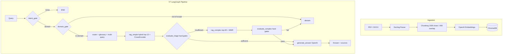

# Regulatory Compliance RAG

**Production RAG pipeline for Russian regulatory documents (GOST, SNiP, Labour Code) — answers questions with citations or explicitly abstains when uncertain.**

[](https://python.org)
[](https://github.com/spqr-86/regulatory-rag/actions/workflows/ci.yml)
[](https://opensource.org/licenses/MIT)

**In-scope correctness: 7.7/10 · Faithfulness: 0.936 · OOS abstain: 1.00 · Latency: 9.5s · Cost: $0.01/query**

> Metrics from the latest eval (`gpt-4o` judge). The reasoning behind the architecture is in [docs/explanation/design-decisions.md](./docs/explanation/design-decisions.md).

[Russian README →](./README_RU.md)

---

## The problem

Regulatory documents in industrial domains (workplace safety, water treatment, construction) span hundreds of PDFs with cross-references. Manual lookup is slow and error-prone. A hallucinated answer to a compliance question isn't a UX issue — it's a liability.

This project explores how far RAG + deterministic guardrails can go toward reliable Q&A over regulatory corpora.

---

## How it works

```
User query
    ↓
intent_gate          — regex filter, drops noise before retrieval
    ↓
domain_gate          — cosine-to-centroid OOS filter, abstains before retrieval
    ↓
router               — query plan + glossary expansion + multi-query (RRF merge)
    ↓
rag_simple           — hybrid retrieval (BM25 + vectors, top-12) + CrossEncoder rerank
    ↓
evaluate_triage      — deterministic hard gates (no LLM scoring)
    ├── sufficient    → generate_answer (OpenAI GPT-4o)
    └── insufficient  → rag_complex (top-60 + MMR) → evaluate_complex
                            ├── pass  → generate_answer
                            └── fail  → abstain (explicit refusal)
```

Key design decisions:
- **No LLM routing** — all branching decisions use deterministic score thresholds
- **Abstain > hallucinate** — system refuses to answer when retrieval confidence is low
- **Two-stage retrieval** — fast path handles most queries; slow path activates only when needed

📖 **Docs:** [architecture](./docs/explanation/architecture.md) · [design decisions](./docs/explanation/design-decisions.md) · [full documentation](./docs/README.md)

---

## Metrics

| Metric | Value | Target |
|--------|-------|--------|
| In-scope correctness (LLM-as-judge, 0–10) | **7.7** | > 7.5 ✅ |
| Correctness, all questions | **7.7** | > 7.5 ✅ |
| Faithfulness (no hallucinations, 0–1) | **0.936** | > 0.85 ✅ |
| Answer relevance (0–1) | **0.924** | > 0.85 ✅ |
| OOS abstain rate | **1.00** | > 0.90 ✅ |
| False-sufficiency (proxy: correctness ≤5 on answered questions) | **5.0%** (2 corpus gaps) | < 10% ✅ |
| Cost per query | **$0.0102** | — |
| Avg latency | **9.5s** (p50=7.8s, p90=17.7s) | ✅ |

Eval: 57-question golden dataset (50 valid), `eval/run_v7_eval.py`, judge `gpt-4o`
(`benchmarks/eval_v7_cap100_2026-06-11.jsonl`). Numbers are judge-dependent — the current
judge is stricter than earlier runs, so absolute values are lower but better calibrated.
Canonical values: [docs/reference/FACTS.md](./docs/reference/FACTS.md).

**CrossEncoder candidate cap sweep** (`RERANK_CANDIDATE_CAP`, same judge/seed/dataset):

| cap | correctness | faithfulness | mean latency | p90 |
|-----|-------------|-------------|-------------|-----|
| 477 (uncapped) | 7.76 | 0.898 | 16.3s | 14.9s |
| 50 | 7.52 | 0.876 | 7.2s | 10.4s |
| **100 (selected)** | **7.72** | **0.936** | **9.5s** | 17.7s |

cap=100 dominates cap=477 on latency (−42% mean) and matches on correctness. cap=50 has
the best tail but costs −0.24 correctness and misroutes borderline queries to complex path.

---

## Quick start

```bash
git clone https://github.com/spqr-86/regulatory-rag.git
cd regulatory-rag
pip install -r requirements.txt
cp .env.example .env  # add OPENAI_API_KEY (LLM + embeddings)
```

Drop your PDF/DOCX regulatory documents into `source_docs/`, then:

```bash
python index.py        # index documents → ChromaDB
streamlit run app.py   # UI at http://localhost:8501
uvicorn api:app --port 8503  # REST API at http://localhost:8503/docs
```

Defaults to Gemini + Chroma + OpenAI embeddings. See [Backend abstraction](#backend-abstraction) to swap any layer via `.env`.

---

## Architecture



### GOST corpus (separate index)

108 GOST/SNiP documents → **9,344 chunks** in ChromaDB collection `wta_gosts` (example corpus, not included in repo — bring your own documents).
API endpoint: `POST /query/gosts`. Generation: DeepSeek V3.

---

## REST API

Run the FastAPI backend alongside Streamlit:

```bash
uvicorn api:app --port 8503
```

**`POST /query`** — main RAG pipeline

```bash
curl -X POST http://localhost:8503/query \
  -H "Content-Type: application/json" \
  -d '{"question": "How often must repeated safety briefings be conducted?"}'
```

```json
{
  "answer": "Repeated briefings must be conducted at least once every 6 months...",
  "passages": [{"text": "...", "source": "doc.pdf", "score": 0.91}],
  "path": "rag_simple",
  "elapsed_sec": 4.2
}
```

**`POST /query/gosts`** — search GOST/SNiP corpus (separate index, DeepSeek V3)

```bash
curl -X POST http://localhost:8503/query/gosts \
  -H "Content-Type: application/json" \
  -d '{"question": "Степень защиты IP55 — что означает?"}'
```

**`GET /health`** — readiness check

```bash
curl http://localhost:8503/health
# {"status": "ok", "pipeline_ready": true, "gosts_ready": true}
```

Interactive docs: `http://localhost:8503/docs`

---

## Stack

| Layer | Technology |
|-------|-----------|
| Orchestration | LangGraph (V7 deterministic graph) |
| LLM | Gemini, OpenAI, DeepSeek — configurable per path via `SIMPLE/COMPLEX_LLM_PROVIDER` in `.env` |
| Embeddings | OpenAI text-embedding-3-small |
| Vector store | ChromaDB |
| Reranking | CrossEncoder (sentence-transformers); FlashRank selectable via `RERANKER_BACKEND` |
| ETL | Docling (PDF/DOCX → chunks) |
| Evaluation | Ragas + custom LLM-as-judge |
| UI | Streamlit |

---

## Backend abstraction

LLM and vector store are accessed through factory layers (`src/infra/llm_factory.py`, `src/backends/`). Adding a new provider is one file plus one registry entry — pipeline code does not change.

| Layer | Shipped | Configurable via | Roadmap |
|-------|---------|------------------|---------|
| LLM   | Gemini, OpenAI, DeepSeek | `LLM_PROVIDER` | Anthropic |
| Vector store | Chroma | `VECTOR_STORE` | Qdrant, pgvector |
| Embeddings | OpenAI, local (sentence-transformers), hf_api | `EMBEDDING_PROVIDER` | — |

**Fully local setup** (no external APIs except LLM):
```bash
LLM_PROVIDER=gemini              # or any other supported provider
VECTOR_STORE=chroma
EMBEDDING_PROVIDER=local
EMBEDDING_MODEL_NAME=ai-forever/sbert_large_nlu_ru
```

**Adding a new LLM provider** (example: Anthropic):
1. Add `_create_anthropic_llm(**kwargs)` to `src/llm_factory.py`
2. Register it in `_LLM_PROVIDERS = {..., "anthropic": _create_anthropic_llm}`
3. Set `LLM_PROVIDER=anthropic` in `.env`

Same pattern for vector stores — implement `VectorStoreBackend` protocol in `src/backends/`, register in the factory. See `docs/plans/2026-05-23-pluggable-backends.md` for the architectural rationale.

---

## Adapting to your domain

The system ships tuned for Russian regulatory documents, but domain-specific knowledge is isolated and easy to swap.

**Term glossary** (`config/term_glossary.yaml`) — maps informal abbreviations to their official full names so BM25 and vector search can match indexed text. Ships with Russian occupational safety terms (ТК РФ, Постановление 2464, etc.). To extend:

```yaml
terms:
  "your abbreviation":
    official: "Full official term from your documents"
    source: "Regulation / standard reference (optional)"
```

No code changes needed — edit the YAML and restart.

**Prompts** (`prompts/`) — Jinja2 templates, versioned. Switch the active version via env var or `prompts/registry.yaml`.

**Corpus** — drop your PDFs into `source_docs/` and run `python index.py`. The chunker and embeddings are language-agnostic (OpenAI `text-embedding-3-small`).

---

## Project status

- ✅ V7 LangGraph pipeline — all nodes, deterministic routing (verifier/rewriter retired — insufficient triage routes straight to rag_complex)
- ✅ Hybrid retrieval — BM25 + semantic, two-stage (simple/complex path)
- ✅ Hard gate thresholds — score-based, no LLM decisions in routing
- ✅ Domain gate — pre-retrieval OOS filter via cosine similarity to corpus centroid
- ✅ HybridChunker v3 — structure-aware chunking aligned to document sections/articles
- ✅ Contextual embedding — parent-section heading prepended to each chunk vector (lightweight Contextual Retrieval)
- ✅ Cross-reference expansion — auto-fetches referenced clauses (e.g. "пункт 46") from same source
- ✅ Multi-query expansion — LLM generates query variants, RRF merge
- ✅ Versioned prompts — Jinja2 templates, registry trimmed to 3 live families; `generate_answer` v8 (anti-sycophancy + value↔condition binding)
- ✅ Eval framework — golden dataset, in-scope correctness 7.4/10, faithfulness 0.86
- ✅ GOST RAG — 108 docs, 9,344 chunks, separate ChromaDB collection
- ✅ Deployed on VPS (port 8502, Streamlit)
- 🔄 Value↔condition robustness on multi-value queries (e.g. program-type periodicity)
- 🔄 Corpus expansion (SOAT methodology, fire safety details)

---

**Author:** Petr Baldaev — [LinkedIn](https://linkedin.com/in/petr-baldaev-b1252b263/) · [GitHub](https://github.com/spqr-86)

[Changelog →](./CHANGELOG.md)
