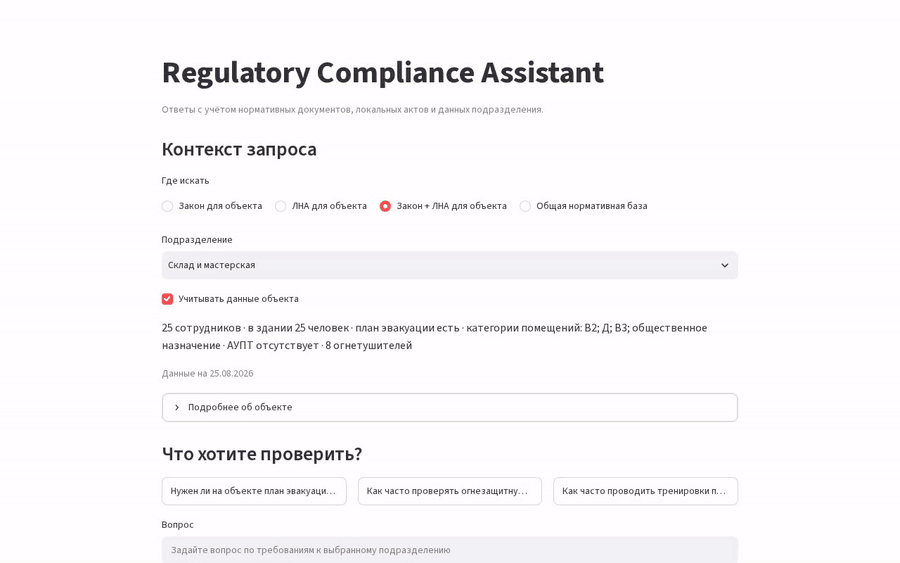
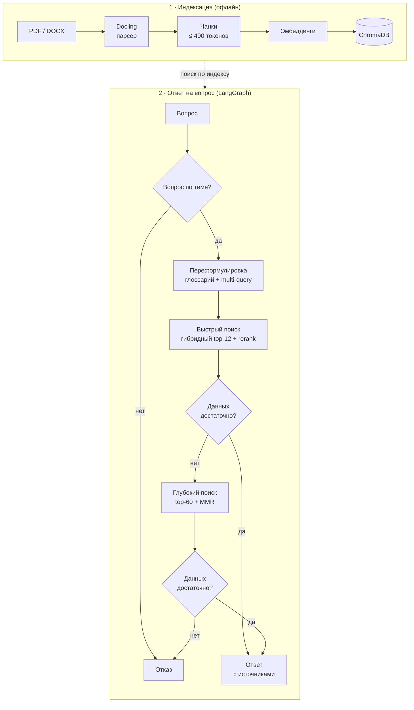
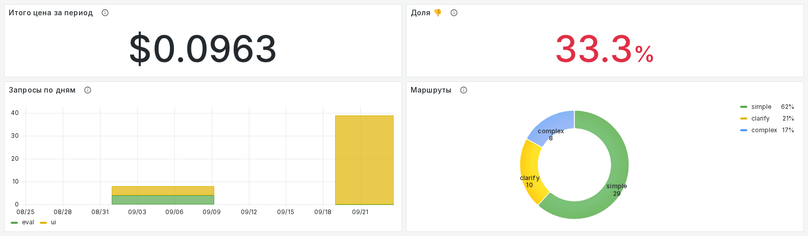

# Regulatory RAG — compliance Q&A с гейтом доказательств

Вопросы по требованиям в распределённой организации — обязателен ли этот инструктаж, как
часто, относится ли он к *этому* объекту — требуют сразу внешней нормы, ЛНА подразделения и
фактов об объекте, а уверенный ответ без основания хуже честного «не знаю».
**Система отвечает со ссылками — либо отказывается.** Основной сценарий — подразделение
спрашивает о своём объекте; общий поиск по нормативке — режим того же экрана.

Автор — практик охраны труда и пожарной безопасности, который строит LLM-системы: домен и
задачи взяты из ежедневной работы.

[](https://python.org)
[](https://github.com/spqr-86/regulatory-rag/actions/workflows/ci.yml)
[](https://opensource.org/licenses/MIT)

In-scope correctness **8.09 / 10** · faithfulness **0.974** · false-sufficiency **7.1%** ·
p50 **9.5 с** · **$0.0021 / запрос** (56-вопросный golden set, судья `gpt-4o`) ·
retrieval HR@5 **0.63** на 90 вопросах практиков, не использованных для тюнинга.

📖 [Отчёт по eval](./docs/evaluation/README.md) · [FACTS](./docs/reference/FACTS.md) ·
[проектные решения](./docs/explanation/design-decisions.md) · [вся документация](./docs/README.md) ·
[English README →](./README.md)

---

## Демо

Снимки живого Streamlit-интерфейса (DeepSeek V4.1 Flash, 23.09.2026). Данные подразделений
синтетические.



*Склад спрашивает, когда испытывать пожарную лестницу: система цитирует норму и ЛНА, видит, что дата
последнего испытания неизвестна, и просит её. Ожидание ответа (~90 с) вырезано.*

| Общая нормативная база — прямой ответ | Общая нормативная база — прямой ответ |
|---|---|
| [](docs/assets/demo/01-generic-internship.png) | [](docs/assets/demo/02-generic-microenterprise.png) |
| Минимальная продолжительность стажировки: ответ со ссылкой на раздел каждого из двух источников. | Проверка знаний на микропредприятии без комиссии: да, с точным пунктом. |
| **Подразделение (склад) — `needs_context`** | **Подразделение (офис) — `needs_context`** |
| [](docs/assets/demo/03-department-depot.png) | [](docs/assets/demo/04-department-office.png) |
| Срок испытания лестницы зависит от даты прошлого испытания, а в листе объекта она «неизвестно» — система показывает норму и известные факты и спрашивает дату, а не угадывает. | Огнетушители и план эвакуации зависят от численности людей в здании и категорий помещений, которых в листе нет, — вывод не выдаётся, недостающие факты запрашиваются. |

---

## Как работает



- **LLM не решает, куда идти** — каждое ветвление по детерминированному порогу; один и тот же
  запрос дважды идёт одним путём.
- **Лучше отказ, чем выдумка** — ответ выпускается только после гейта достаточности; пункты по
  перекрёстным ссылкам подтягиваются до эскалации ([триаж](./docs/explanation/triage.md)).
- **Двухэтапный retrieval** — быстрый путь закрывает ~80% вопросов; глубокий поиск включается,
  только когда гейт говорит, что оснований мало.

---

## Демо


От вопроса до ответа с гейтом (приложение открывается на Q&A подразделений; общий чат — на
второй странице):

1. **Q&A подразделений** — корневой экран. Лист объекта передаётся типизированным профилем, а
   не поиском: ответ разделяет факты объекта и применённые выводы и остаётся условным, когда
   нужное поле — `unknown`.

   

2. **Вопрос** — общий нормативный чат на второй странице: ответ со ссылками, маршрут
   (`simple` / `complex`) и отрендеренные версии промптов.

   

3. **Мониторинг** — со поднятым стеком и `V7_TELEMETRY_WRITER=postgres` каждый запрос
   становится строкой (цена, латентность, маршрут, токены, 👍/👎) на дашборде Grafana.

   

Как поднять стек мониторинга:
[how-to/run-monitoring-stack.md](./docs/how-to/run-monitoring-stack.md).

---

## Метрики

| Метрика | Значение | На чём мерили |
|---|---|---|
| Retrieval HR@5 / HR@12 / MRR (hybrid) | 0.63 / 0.81 / 0.50 | 90 вопросов практиков |
| In-scope correctness | 8.09 / 10 | 43 in-scope вопроса (цель >7.5) |
| Faithfulness | 0.974 | 56-вопросный golden set |
| Answer relevance | 0.853 | 56-вопросный golden set (цель >0.85) |
| Доля отказов на вопросах не по теме | 1.00 | 7 вопросов не по теме |
| False-sufficiency | 7.1% | ответы быстрого пути, которые судья оценил < 5/10 (цель <10%) |
| Латентность p50 / p95 | 9.5 / 25.9 с | на запрос, end-to-end |
| Стоимость запроса | $0.0021 ($0.11 / прогон) | по токенам провайдера, rate card `src/pricing.py` |

*False-sufficiency* — доля ответов быстрого пути, которые судья затем оценил ниже 5/10: «как
часто быстрый путь выпускал слабый ответ», а не доля галлюцинаций. Цифры генерации зависят от
судьи (±0.25 от прогона к прогону); знаменатели и сравнение с прошлыми прогонами —
[отчёт по eval](./docs/evaluation/README.md).

**Что показали замеры**
([эксперименты](./docs/evaluation/experiments/README.md)):
- Гибридный retrieval оставлен по замеру: только BM25 отсеян, vector и hybrid почти вровень
  ([мемо](./docs/evaluation/experiments/retrieval-backbones.md)).
- DeepSeek V4.1 Flash — самая дешёвая из шести проверенных моделей, прошедшая все четыре
  ловушки на пороги ([мемо](./docs/evaluation/experiments/cheap-model-selection.md)); 5×
  регрессию латентности, пришедшую с ней, свели к reasoning effort провайдера по умолчанию и
  исправили ([мемо](./docs/evaluation/experiments/golden-set-effort-low.md)).
- Отвергнуто по замеру и задокументировано: тюнинг `RRF_K`, 81 альтернативный профиль порогов
  гейта, разметка «норма → поле».

---

## Q&A подразделений

Вопросы **конкретного подразделения** о своём объекте; ответ строится по законодательству
компании, ЛНА подразделения и листу объекта. Лист не ранжируется как норма: он разбирается в
структурированный профиль и целиком идёт в промпт, поэтому ответ цитирует факты объекта и
применяет к ним норму. Недостающие факты запрашиваются, а не угадываются.

`answered` значит **«ссылки сверены»**, а не «содержание проверено»: каждый процитированный id
существует, оба уровня норм на месте, детерминированный гейт отклоняет вывод, построенный на
поле, которое лист помечает как неизвестное. Подтверждает ли цитата утверждение — меряется в
eval, в рантайме не проверяется. Дизайн: [спека](./docs/design/2026-09-14-department-qa-mvp-design.md) ·
[профиль объекта](./docs/design/2026-09-15-object-profile-design.md) ·
[результаты](./docs/evaluation/experiments/department-qa-object-profile.md).

---

## Быстрый старт

```bash
git clone https://github.com/spqr-86/regulatory-rag.git && cd regulatory-rag
python -m venv .venv && source .venv/bin/activate && pip install -r requirements.txt
cp .env.example .env            # OPENROUTER_API_KEY (LLM) + OPENAI_API_KEY (эмбеддинги, судья)
python index.py                 # PDF/DOCX из source_docs/ → ChromaDB
streamlit run app.py --server.port 8502    # UI
uvicorn api:app --port 8503                 # REST API, документация на /docs
```

Экрану подразделений нужны манифест и профили объектов:
[быстрый старт](./docs/getting-started.md#run-the-ui). LLM, эмбеддинги, реранкер и векторное
хранилище меняются через `.env` ([конфигурация](./docs/reference/configuration.md)).

**Мониторинг** (опционально): `docker compose up -d` поднимает Postgres + Grafana; каждый
запрос — строка со стоимостью, латентностью, маршрутом и 👍/👎
([how-to](./docs/how-to/run-monitoring-stack.md)).

[](docs/assets/grafana-queries.png)

---

## Стек

| Слой | Технология |
|------|-----------|
| Оркестрация | LangGraph (детерминированный граф V7) |
| LLM | OpenRouter `deepseek/deepseek-v4.1-flash` (оба пути); OpenAI, Gemini, DeepSeek, OpenRouter настраиваются по пути |
| Эмбеддинги | OpenAI text-embedding-3-small (опционально локальные sentence-transformers) |
| Векторное хранилище | ChromaDB |
| Реранкинг | CrossEncoder (sentence-transformers); FlashRank на выбор |
| ETL | Docling (PDF/DOCX → чанки), HybridChunker |
| Оценка | собственный LLM-as-judge (faithfulness, relevance, correctness) + IR-метрики (HR@k, MRR) |
| Мониторинг | Postgres + Grafana (docker compose), события пишутся изнутри графа |
| UI | Streamlit |

---

## Ограничения

- **Малые выборки:** вопросов не по теме 7, подразделений 9, ловушек на пороги 4 — это
  проверка на здравый смысл, а не гарантия.
- **Судья независимо не валидирован** (`gpt-4o`, в [roadmap](./docs/roadmap.md)).
- **Answer relevance проходит цель впритык** (0.853): упала с 0.887 после исправления
  reasoning effort, которое сократило латентность.
- **Латентность всё ещё ~2× от прежнего бейзлайна на GPT-4o-mini** (p50 9.5 с против 4.5 с).
- **`answered` проверяет ссылки, а не содержание** — содержание меряется в eval.
- **Таблицы приказа 29н теряют шапку при нарезке**
  ([#64](https://github.com/spqr-86/regulatory-rag/issues/64)).
- **Запросы подразделений пишутся в телеметрию с нулевой стоимостью**
  ([#66](https://github.com/spqr-86/regulatory-rag/issues/66)); оценок 👍/👎 единицы.
- **Данные подразделений синтетические; стенд доступен только с localhost**, публичного демо нет.

---

## Статус проекта

Портфельный MVP завершён (2026-09-21): пайплайн с гейтом доказательств, гибридный retrieval,
Q&A подразделений, офлайн-оценка и онлайн-телеметрия. Задеплоен на VPS как сервис только для
localhost. Бэклог после MVP: [roadmap](./docs/roadmap.md) · [changelog](./CHANGELOG.md).

**Автор:** Пётр Балдаев — [LinkedIn](https://linkedin.com/in/petr-baldaev-b1252b263/) · [GitHub](https://github.com/spqr-86)
