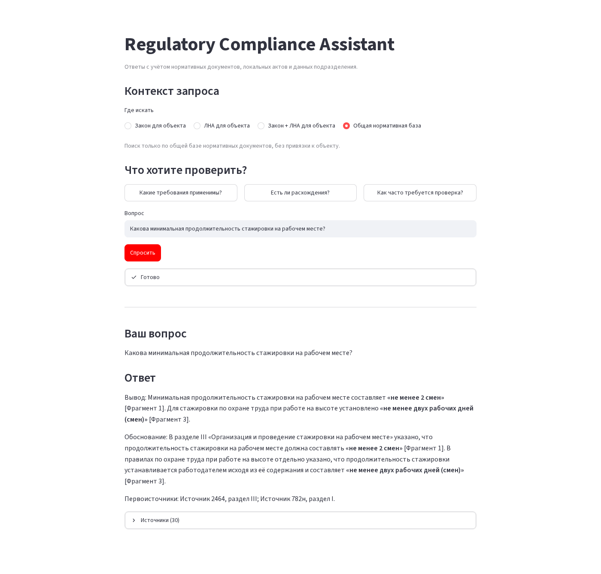
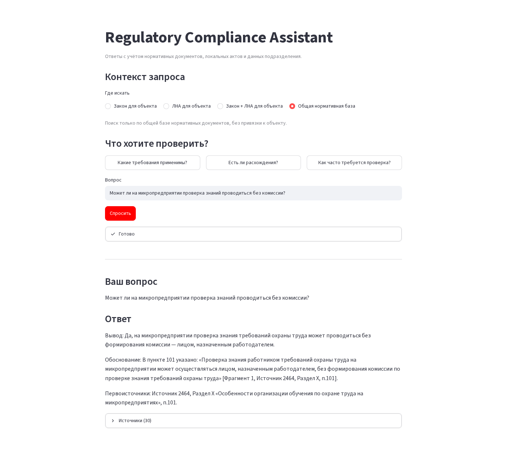
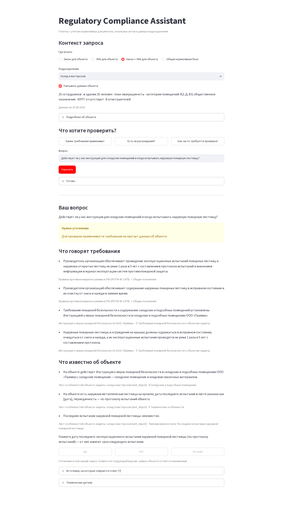
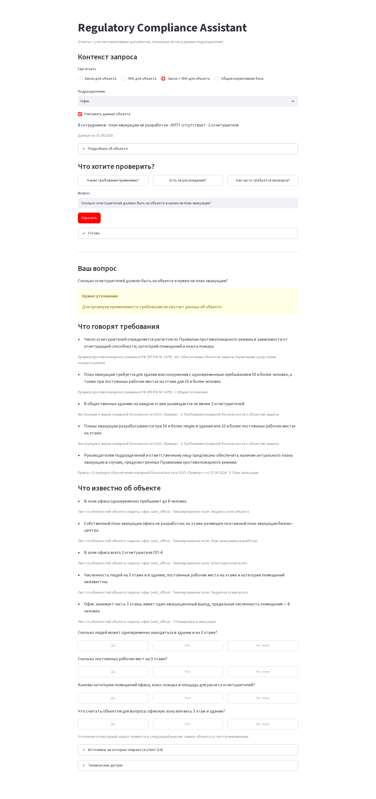
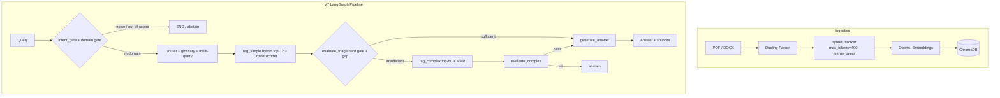

# Regulatory RAG — compliance Q&A с гейтом доказательств

В распределённой организации одни и те же вопросы по требованиям возвращаются каждую неделю:
обязателен ли ещё этот инструктаж, как часто и относится ли он к *этому* конкретному объекту.
Ответ обычно лежит сразу в трёх местах — внешняя норма (ГОСТ, СНиП, ТК РФ, правила по
пожарной и трудовой безопасности), собственный ЛНА подразделения и записанные факты самого
объекта. Ручной поиск по сотням PDF с плотными перекрёстными ссылками медленный, а в
нормативке уверенный ответ без основания хуже честного «не знаю».

**Система отвечает на такие вопросы со ссылками — либо отказывается.** Каждое ветвление
детерминированно (пороги по метрикам, LLM в роутинге не участвует), ответ выпускается только
после гейта достаточности, а retrieval и генерация меряются раздельно — чтобы неверный ответ
можно было отнести к отсутствующему чанку или к неверному решению по хорошему чанку.

[](https://python.org)
[](https://github.com/spqr-86/regulatory-rag/actions/workflows/ci.yml)
[](https://opensource.org/licenses/MIT)

**Retrieval** (90 вопросов, взятых дословно с форумов специалистов по ОТ/ПБ и никогда не
использованных для тюнинга): HR@5 **0.63** · HR@12 **0.81** · MRR **0.50**.
**Генерация** (56-вопросный golden set, судья `gpt-4o`, витринный дефолт
`deepseek/deepseek-v4.1-flash`): in-scope correctness **7.91 / 10** ·
faithfulness **0.926** · answer relevance **0.887** · **~$0.0066/запрос**, p50 **24.0 с**.

Одна цифра всё ещё не дотягивает до цели и приводится всё равно: false-sufficiency 10.0% при
цели <10% (мимо на 0.1 п.п.). Витринный дефолт работает примерно в 5 раз медленнее прежнего
бейзлайна на GPT-4o-mini (p50 4.5 с → 24 с), причина пока не выяснена. Размеры выборок и что
именно стоит в знаменателе каждой метрики — в разделе [Метрики](#метрики); разбор починки цены —
в [мемо](./docs/evaluation/experiments/showcase-default-golden-set.md).

> Канонические значения — в [docs/reference/FACTS.md](./docs/reference/FACTS.md). Проектные
> решения: [docs/explanation/design-decisions.md](./docs/explanation/design-decisions.md).
> Полная методология, эксперименты и ограничения доказательности:
> [отчёт по eval](./docs/evaluation/README.md).

[English README →](./README.md)

---

## Демо

Снимки живого Streamlit-интерфейса (DeepSeek V4.1 Flash, 23.09.2026). Данные подразделений
синтетические.

| Общая нормативная база — прямой ответ | Общая нормативная база — прямой ответ |
|---|---|
| [](docs/assets/demo/01-generic-internship.png) | [](docs/assets/demo/02-generic-microenterprise.png) |
| Минимальная продолжительность стажировки: ответ со ссылкой на раздел каждого из двух источников. | Проверка знаний на микропредприятии без комиссии: да, с точным пунктом. |
| **Подразделение (склад) — `needs_context`** | **Подразделение (офис) — `needs_context`** |
| [](docs/assets/demo/03-department-depot.png) | [](docs/assets/demo/04-department-office.png) |
| Срок испытания лестницы зависит от даты прошлого испытания, а в листе объекта она «неизвестно» — система показывает норму и известные факты и спрашивает дату, а не угадывает. | Огнетушители и план эвакуации зависят от численности людей в здании и категорий помещений, которых в листе нет, — вывод не выдаётся, недостающие факты запрашиваются. |

---

## Как работает



Ключевые проектные решения:
- **LLM не решает, куда идти** — все ветвления по детерминированным порогам, один и тот же
  запрос дважды идёт одним путём.
- **Лучше отказ, чем выдумка** — при низкой уверенности поиска система отказывается; триаж —
  hard-gate по трём метрикам плюс структурированный пробел достаточности, который подтягивает
  пункты по перекрёстным ссылкам до эскалации ([триаж](./docs/explanation/triage.md)).
- **Двухэтапный retrieval** — быстрый путь закрывает большинство запросов; медленный
  (top-60 + MMR) включается, только когда гейт говорит, что оснований мало.

В поставляемом индексе 12 нормативных документов (~7,8 тыс. чанков) — это пример корпуса,
подставляйте свой. Точные значения: [FACTS § corpus](./docs/reference/FACTS.md#corpus).

📖 **Документация:** [архитектура](./docs/explanation/architecture.md) · [проектные решения](./docs/explanation/design-decisions.md) · [отчёт по eval](./docs/evaluation/README.md) · [FACTS](./docs/reference/FACTS.md) · [вся документация](./docs/README.md)

---

## Метрики

| Метрика | Значение | На чём измерено |
|---|---|---|
| Retrieval HR@5 / HR@12 / MRR (гибрид) | 0.63 / 0.81 / 0.50 | 90 вопросов практиков |
| In-scope correctness | 7.91 / 10 | 43 in-scope вопроса (цель >7.5, достигнута) |
| Correctness (все вопросы) | 7.98 / 10 | 56-вопросный golden set |
| Faithfulness | 0.926 | 56-вопросный golden set |
| Answer relevance | 0.887 | 56-вопросный golden set |
| Отказ на OOS-запросах | 1.00 | только OOS-подмножество — 7 вопросов, выборка мала |
| False-sufficiency rate | 10.0% | доля ответов simple-пути, которым судья поставил < 5/10 (цель <10%, мимо на 0.1 п.п.) |
| Доля complex-пути | 24.5% | 56-вопросный golden set |
| Латентность p50 / p95 / mean | 24.0 / 71.3 / 30.95 с | на запрос, end-to-end |
| Стоимость запроса | $0.00657 ($0.348 / прогон) | по фактическим токенам провайдера, rate card `src/pricing.py` |

**Как это читать.** Golden set — 56 вопросов: 43 in-scope, 7 out-of-scope, 6 с ложной
посылкой; в отчётном прогоне валидны 53 из 56 ответов. *False-sufficiency* — не доля
галлюцинаций и не доля ошибок гейта: это доля ответов, выпущенных быстрым путём, которым
судья затем поставил ниже 5/10 (`eval/run_v7_eval.py`); метрика отвечает на вопрос «как часто
быстрый путь выпустил слабый ответ». *Отказ на OOS* измеряется только на OOS-подмножестве,
поэтому 1.00 стоит на 7 вопросах и читается как проверка вменяемости, а не как гарантия. Все
метрики генерации зависят от судьи: сравнивать прогоны только под одним судьёй. Retrieval
меряется независимо (`eval/run_retrieval_eval.py`) на вопросах, замороженных до любого тюнинга.

---

## Что показали замеры

Retrieval и генерация меряются **раздельно** — единый end-to-end score скрывает, откуда
пришёл неверный ответ: нужного чанка не было или решение по хорошему чанку было неверным.
Полная методология, разборы экспериментов и ограничения доказательности:
[docs/evaluation/](./docs/evaluation/README.md).

**Backbone-и retrieval** (90 вопросов практиков; гибрид — прод):

| Backbone | HR@5 | HR@12 | MRR | p50 |
|---|---:|---:|---:|---:|
| гибрид (прод) | 0.633 | 0.811 | 0.503 | 550 мс |
| только вектор | 0.589 | 0.822 | 0.486 | 148 мс |
| только BM25 | 0.500 | 0.667 | 0.352 | 24 мс |

BM25-only дисквалифицирован; вектор и гибрид почти вничью (гибрид берёт top-5 и MRR, которые
кормят реранк; вектор берёт HR@12 и работает ~3,5× быстрее). Гибрид оставлен по замеру, а не
потому что «best practice» ([memo](./docs/evaluation/experiments/retrieval-backbones.md)).

**Q&A подразделений — лист объекта профилем (`v2`) против листа в индексе (`v1`)** (9 вопросов,
ожидания зафиксированы до прогона, `gpt-4o-mini`):

| Замер | v1 | v2 |
|---|---:|---:|
| Ожидаемый статус + причины | 7/9 | 8/9 |
| Засчитанные подответы | 7/17 | 11/17 |
| Запрещённые выводы | 2 | 1 |

Гипотеза, зафиксированные до прогона ожидания, контролируемое сравнение, разбор отказа,
изменение архитектуры. Оставшаяся ошибка `v2` — порог нормы, применённый к факту другой
величины; она пережила итерации промпта, типизированный лист и verifier после генерации, и
исправилась только сменой модели
([memo](./docs/evaluation/experiments/department-qa-object-profile.md)).

**Выбор дешёвой модели на 4 ловушках с порогами** (режим `v2`, один прогон на модель):

| Модель | Ловушки | $ за 4 вопроса |
|---|---:|---:|
| `deepseek/deepseek-v4.1-flash` | **4/4** | $0.022 |
| `openai/gpt-5-mini` | 4/4 | $0.049 |
| `google/gemini-3-flash-preview` | 4/4 | $0.030 |
| `openai/gpt-4o-mini` | 2/4 | $0.004 |
| `anthropic/claude-haiku-4.5` | 2/4 | $0.057 |
| `deepseek/deepseek-v4-flash` | 1–1.5/4 | $0.003 |

DeepSeek V4.1 Flash — самая дешёвая модель из прошедших все ловушки, она и витринный дефолт.
Контрактный статус не различал верные и неверные ответы — модели сравнивались по семантике
([memo](./docs/evaluation/experiments/cheap-model-selection.md)).

Отклонено по замеру: тюнинг `RRF_K` (мёртвая ручка), другой профиль hard-gate порогов
(81 профиль, ни один не безопаснее), ручная разметка «норма → поля». Отрицательные
результаты задокументированы, а не спрятаны: [experiments/](./docs/evaluation/experiments/).

---

## Q&A подразделений

Вторая продуктовая линия на том же ядре поиска: вопросы **от конкретного подразделения** о
своём объекте, ответ поверх двух уровней норм — законодательство компании (`external`) и
собственные ЛНА подразделения (`internal`) — плюс третий уровень, лист объекта. Вертикальный
срез на синтетическом корпусе, ограничения задокументированы.

Лист объекта — не норма, которую надо ранжировать: он парсится в структурированный
**профиль объекта** и подаётся в промпт целиком (`DEPARTMENT_QA_MODE=v2`, дефолт), а не
индексируется обычными чанками (`v1`). В схему ответа добавлены `object_facts` (факты,
процитированные из листа) и `applied_conclusions` (факт объекта плюс применённая к нему
норма) поверх существующего контракта ответа.

`answered` означает **«ссылки сверены»**, а не «смысл проверен»: каждый процитированный id
существует с верной ролью, нет блокирующего уточняющего вопроса, оба уровня норм
присутствуют, у процитированного профиля есть дата заполнения, а детерминированный гейт
отклоняет вывод, опирающийся на поле со статусом `unknown`. Действительно ли цитата
подтверждает утверждение — меряется в eval, а не в рантайме, и UI это говорит.

- Спеки: [Q&A подразделений](./docs/design/2026-09-14-department-qa-mvp-design.md) · [профиль объекта](./docs/design/2026-09-15-object-profile-design.md)
- Режим, env и граница гарантии: [FACTS § department qa](./docs/reference/FACTS.md#department-qa)
- Результаты и известная ошибка: [отчёт по eval](./docs/evaluation/README.md)

---

## Быстрый старт

```bash
git clone https://github.com/spqr-86/regulatory-rag.git
cd regulatory-rag
python -m venv .venv && source .venv/bin/activate
pip install -r requirements.txt
cp .env.example .env  # заполнить OPENAI_API_KEY (embeddings, complex-путь, судья) + OPENROUTER_API_KEY (simple-путь)
```

Положите PDF/DOCX нормативных документов в `source_docs/`, затем:

```bash
python index.py                              # индексировать → ChromaDB (пересобирает коллекцию; старый индекс удаляется только после успешной нарезки)
streamlit run app.py --server.port 8502      # UI на http://localhost:8502
uvicorn api:app --port 8503                   # REST API на http://localhost:8503/docs
```

По умолчанию: ChromaDB, embeddings OpenAI и LLM в двух провайдерах (OpenRouter на simple-пути,
OpenAI на complex). Любой слой — LLM, embeddings, реранкер, vector store — меняется через
`.env`, а глоссарий, промпты и корпус — это то, что правят при переносе системы в другой
домен: [справочник по конфигурации](./docs/reference/configuration.md).

**Мониторинг** (опционально): `docker compose up -d` поднимает Postgres + Grafana; с
`V7_TELEMETRY_WRITER=postgres` каждый запрос становится строкой (цена, латентность, маршрут,
токены, `source`), а дашборд *Regulatory RAG — запросы* на `http://localhost:3000/d/regrag-queries`
показывает стоимость, долю 👎, маршруты и p50/p95. Без стека ничего не ломается: события идут
в `logs/events.jsonl` и заливаются позже. Настройка, порты и разбор проблем:
[how-to/run-monitoring-stack.md](./docs/how-to/run-monitoring-stack.md).

**REST API:** `POST /query` (весь пайплайн), `POST /retrieve` (только поиск, без LLM),
`GET /corpus`, `GET /health`. Форматы запроса и ответа, примеры и лимиты:
[reference/api.md](./docs/reference/api.md); интерактивная документация — `http://localhost:8503/docs`.

---

## Стек

| Слой | Технология |
|------|-----------|
| Оркестрация | LangGraph (V7 детерминированный граф) |
| LLM | OpenRouter `deepseek/deepseek-v4.1-flash` (оба пути); OpenAI, Gemini, DeepSeek, OpenRouter настраиваются по путям |
| Embeddings | OpenAI text-embedding-3-small (локальные sentence-transformers опционально) |
| Vector store | ChromaDB |
| Переранжирование | CrossEncoder (sentence-transformers); FlashRank выбирается через `RERANKER_BACKEND` |
| ETL | Docling (PDF/DOCX → чанки), HybridChunker |
| Оценка | кастомный LLM-as-judge (faithfulness, relevance, correctness) + IR-метрики (HR@k, MRR) |
| Мониторинг | Postgres + Grafana (docker compose), события пишутся изнутри графа |
| UI | Streamlit |

---

## Статус проекта

**Портфельный MVP завершён 21.09.2026.** Основной пайплайн и eval закрыты 11.09.2026; режим
Q&A подразделений / профиля объекта ниже доделан позже и закрыт 21.09.2026. Сделано:

- **LangGraph-пайплайн с гейтом доказательств** — детерминированный роутинг, hard-gate
  достаточности по трём метрикам, структурированный triage gap, явный отказ
- **Гибридный retrieval** — BM25 + векторы, реранк CrossEncoder, два этапа, с раскрытием
  перекрёстных ссылок и расширением запроса через глоссарий и multi-query
- **Режим с учётом объекта** — Q&A подразделений поверх внешних и внутренних норм плюс
  типизированный профиль объекта, детерминированные гейты цитат и `unknown`-полей
- **Offline eval** — golden set и набор из 90 вопросов практиков для retrieval, раздельный
  замер поиска и генерации, цена и латентность на запрос, отрицательные результаты сохранены
- **Онлайн-телеметрия** — каждый запрос строкой в Postgres, дашборд Grafana, 👍/👎 под
  ответом; весь стек — один `docker compose up`

Задеплоено на VPS (Streamlit, порт 8502). Полный список реализованного и необязательный
post-MVP backlog (независимая валидация судьи, разделение ошибок retrieval и generation,
эксперимент с нарезкой таблиц и заголовков) — в [docs/roadmap.md](./docs/roadmap.md);
результаты, отклонённые варианты и ограничения доказательности — в
[отчёте по eval](./docs/evaluation/README.md).

---

**Автор:** Пётр Балдаев — [LinkedIn](https://linkedin.com/in/petr-baldaev-b1252b263/) · [GitHub](https://github.com/spqr-86)

[Changelog →](./CHANGELOG.md)
