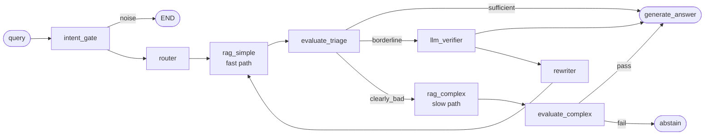
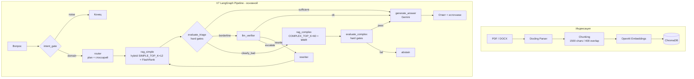

# Regulatory Compliance Q&A — RAG / Multi-Agent

[](https://python.org)
[](https://github.com/spqr-86/safety-incident-analyzer/actions)
[](https://opensource.org/licenses/MIT)

---

## Что это?

**Regulatory Compliance Q&A** — RAG-система с агентным пайплайном для ответов на вопросы по нормативной документации (ГОСТ, СНиП, СП, внутренние регламенты).

Пользователь задаёт вопрос на естественном языке → система выполняет гибридный поиск по проиндексированным документам → верифицирует ответ по score-порогам → возвращает цитату с указанием источника или явно отказывается отвечать при недостатке данных.

---

## Зачем?

Нормативная база в регулируемых отраслях — сотни документов с перекрёстными ссылками. Ручной поиск по ним медленный и ошибочный. Галлюцинация в нормативном ответе — это не UX-проблема, а прямой риск. Проект исследует, насколько RAG + guardrails решают задачу надёжного Q&A по нормативам.

**Ключевые возможности:**

*   ✅ 🔎 **Гибридный поиск**: комбинация семантического поиска (векторы) и BM25. Two-Stage Retrieval: Stage 1 — быстрый широкий поиск (top-60 кандидатов), Stage 2 — FlashRank Cross-Encoder реранкинг (оценивает каждую пару Query+Document → отбирает лучшие).
*   ✅ 🧠 **V7 LangGraph Pipeline**: модульный граф rag_simple → rag_complex → evaluate_complex → generate_answer с детерминированными hard gates.
*   ✅ ⚖️ **Нормативная точность**: строгая фильтрация — ответ только по подтверждённым фрагментам, abstain при недостаточной уверенности.
*   ✅ 🛡️ **Guardrails**: `intent_gate` (input filter — отсекает шум и OOS до retrieval) + детерминированные hard gates (output validation — score-пороги без LLM) + abstain при низкой уверенности. Нормативный вывод = высокая цена ошибки.
*   ✅ 📄 **Универсальная загрузка**: PDF/DOCX через Docling → chunking → OpenAI embeddings → ChromaDB.
*   ✅ 📖 **Доменный глоссарий**: детерминированное расширение запросов — "программа А" → официальный термин перед retrieval.
*   ✅ 📊 **Eval framework**: golden-датасет + LLM-as-judge метрики (faithfulness, correctness, answer relevance) через `eval/run_v7_eval.py`.
*   ✅ 📚 **ГОСТ RAG**: 108 нормативных документов (ГОСТы, СНиПы) проиндексированы отдельно (9 344 чанка, ChromaDB `wta_gosts`). API эндпоинт `POST /query/gosts` для поиска по нормативной базе.

---

## 🧠 Ключевые технические решения

### V7 LangGraph Pipeline (основной)

Модульный детерминированный граф без LLM-роутинга:



1.  **`intent_gate`**: regex-классификация noise/domain (+ опциональный domain gate). noise → END.
2.  **`router`**: классификация запроса, построение `plan`, расширение `active_query` через глоссарий.
3.  **`rag_simple`** (fast path): hybrid retrieval (`SIMPLE_TOP_K=12`) + FlashRank rerank.
4.  **`evaluate_triage`**: детерминированные hard gates → sufficient / borderline / clearly_bad.
5.  **`rag_complex`** (slow path): расширенный поиск (`COMPLEX_TOP_K=60`) + rerank + MMR-диверсификация.
6.  **`evaluate_complex`**: hard gates по score-порогам, без LLM-вердиктов.
7.  **`generate_answer`**: синтез ответа через Gemini (thinking_budget=4096). Retry при 503.
8.  **Доменный глоссарий** (`src/glossary.py` + `config/term_glossary.yaml`): расширение запросов в ноде `router`.

### 📊 Метрики

| Метрика | Значение | Цель |
| :--- | :--- | :--- |
| **Correctness** | **7.9/10** | > 7.5 |
| **Faithfulness** | **0.988** | > 0.85 |
| **Answer Relevance** | **0.85+** | > 0.85 |
| **False-sufficiency** | 15% | < 10% |
| **Cost per query** | $0.0102 | — |
| **Avg latency** | 21.9 сек | — |

### 💰 Экономика (CPS baseline, 2026-05-22)

Замер на 10 вопросах из `tests/dataset_original.csv`:

| Метрика | Значение |
| :--- | :--- |
| **Cost per query** | **$0.0102** (~$10.21 / 1 000 запросов) |
| Avg input tokens | 4 920 |
| Avg output tokens (incl. thinking) | 3 495 |
| Avg latency | 21.9 сек |

---

## 🚀 Быстрый старт

```bash
git clone https://github.com/spqr-86/safety-incident-analyzer.git
cd safety-incident-analyzer
pip install -r requirements.txt
cp .env.example .env  # добавить OPENAI_API_KEY + GEMINI_API_KEY
```

Положите документы (PDF, DOCX) в папку `source_docs/`, затем:

```bash
python index.py        # индексировать документы → ChromaDB
streamlit run app.py   # открыть http://localhost:8501
```

---

## 🏗 Архитектура



---

## 🛠 Технологии

| Категория | Технологии |
| :--- | :--- |
| **Язык** | Python 3.11+ |
| **UI** | Streamlit |
| **LLM Framework** | LangChain, LangGraph |
| **LLM Providers** | Google Gemini 2.5 Flash (generation), DeepSeek V3 (GOST RAG) |
| **Embeddings** | OpenAI text-embedding-3-small |
| **Vector Store** | ChromaDB |
| **ETL** | Docling |
| **Reranking** | FlashRank |
| **Evaluation** | Ragas, Custom metrics |

---

## 📈 Статус проекта

*   ✅ V7 LangGraph Pipeline
*   ✅ Hybrid Retrieval (ChromaDB + BM25, FlashRank rerank)
*   ✅ Hard gates с детерминированными score-порогами
*   ✅ Eval framework — correctness 7.9/10
*   ✅ ГОСТ RAG — 108 документов, 9 344 чанка
*   ✅ Задеплоен на VPS (порт 8502)
*   🔄 Расширение тестового датасета
*   🔄 Снижение false-sufficiency (цель < 10%)

---

**Автор:** Петр Балдаев — [LinkedIn](https://linkedin.com/in/petr-baldaev-b1252b263/) · [GitHub](https://github.com/spqr-86)
