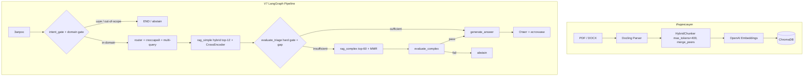

# Regulatory Compliance RAG

**RAG-пайплайн для российских нормативных документов (ГОСТ, СНиП, ТК РФ, правила по пожарной безопасности и охране труда) — отвечает на вопросы с указанием источника или явно отказывается от ответа при недостаточной уверенности.**

[](https://python.org)
[](https://github.com/spqr-86/regulatory-rag/actions/workflows/ci.yml)
[](https://opensource.org/licenses/MIT)

**Качество ответов** (56-вопросный golden set, судья `gpt-4o`): in-scope correctness **7.47 / 10** · faithfulness **0.891** · answer relevance **0.879** · отказ на OOS **1.00** · false-sufficiency **11.4%** · complex-путь **17%** · **~$0.0039/запрос**, p50 **4.5 с**.

> Метрики зависят от судьи — канонические значения в [docs/reference/FACTS.md](./docs/reference/FACTS.md). Архитектурные решения описаны в [docs/explanation/design-decisions.md](./docs/explanation/design-decisions.md).

[English README →](./README.md)

---

## Проблема

Нормативные документы в промышленных отраслях (охрана труда, пожарная безопасность, строительство) — это сотни PDF с перекрёстными ссылками. Ручной поиск медленный и ненадёжный. Галлюцинированный ответ на вопрос по нормативам — это не UX-проблема, а прямой риск.

Проект исследует, насколько RAG + детерминированные guardrails решают задачу надёжного Q&A по нормативной базе.

---

## Как работает

```
Запрос пользователя
    ↓
intent_gate          — regex-фильтр шума + (опционально) cosine-to-centroid OOS-гейт, до retrieval
    ↓
router               — план запроса + расширение глоссарием + multi-query (RRF-слияние)
    ↓
rag_simple           — гибридный retrieval (BM25 + векторы, top-12) + CrossEncoder rerank
    ↓
evaluate_triage      — детерминированный гейт достаточности (без LLM-оценки)
    ├── sufficient    → generate_answer
    └── insufficient  → rag_complex (top-60 + MMR) → evaluate_complex
                            ├── pass  → generate_answer
                            └── fail  → abstain (явный отказ)
```

Ключевые архитектурные решения:
- **Нет LLM-роутинга** — все ветвления используют детерминированные пороги по score
- **Abstain лучше галлюцинации** — система отказывается отвечать при низкой уверенности retrieval
- **Двухэтапный retrieval** — быстрый путь обрабатывает большинство запросов; медленный активируется только при необходимости

Триаж — единый детерминированный путь: hard-gate по трём метрикам плюс структурированный
пробел достаточности, который добирает перекрёстно упомянутые пункты до эскалации. См.
[docs/explanation/triage.md](./docs/explanation/triage.md).

📖 **Документация:** [архитектура](./docs/explanation/architecture.md) · [проектные решения](./docs/explanation/design-decisions.md) · [отчёт по eval](./docs/evaluation/README.md) · [FACTS](./docs/reference/FACTS.md) · [полная документация](./docs/README.md)

---

## Метрики

| Метрика | Значение |
|---|---|
| In-scope correctness | 7.47 / 10 |
| Correctness (все вопросы) | 7.26 / 10 |
| Faithfulness | 0.891 |
| Answer relevance | 0.879 |
| Отказ на OOS-запросах | 1.00 |
| False-sufficiency rate | 11.4% |
| Доля complex-пути | 17% |
| Латентность p50 / p95 / mean | 4.51 / 15.70 / 6.83 с |
| Стоимость запроса | $0.00387 ($0.205 / прогон) |
| Retrieval HR@5 / HR@12 / MRR (hybrid, 90 вопросов практиков) | 0.63 / 0.81 / 0.50 |

Eval: 56-вопросный golden dataset (`tests/dataset.csv`), `eval/run_v7_eval.py`, LLM-судья
`gpt-4o`. Числа зависят от судьи — сравнивать прогоны только под одним судьёй. Retrieval
Hit Rate / MRR меряются отдельно на наборе из 90 реальных вопросов, взятых дословно
с форумов специалистов по ОТ/ПБ, оставлены только те, на которые в корпусе есть ответ;
для тюнинга набор не использовался (`eval/run_retrieval_eval.py`), см.
[docs/roadmap.md](./docs/roadmap.md). Канонические значения:
[docs/reference/FACTS.md](./docs/reference/FACTS.md).

---

## Что показали замеры

Retrieval и генерация меряются **раздельно** — единый end-to-end score скрывает, откуда
пришёл неверный ответ: нужного чанка не было или решение по хорошему чанку было неверным.
Полная методология, разборы экспериментов и ограничения доказательности:
[docs/evaluation/](./docs/evaluation/README.md).

**Backbone-и retrieval** (90 вопросов практиков; гибрид — прод):

| Backbone | HR@5 | HR@12 | MRR | p50 |
|---|---:|---:|---:|---:|
| гибрид (прод) | 0.633 | 0.811 | 0.503 | 550 мс |
| только вектор | 0.589 | 0.822 | 0.486 | 148 мс |
| только BM25 | 0.500 | 0.667 | 0.352 | 24 мс |

BM25-only дисквалифицирован; вектор и гибрид почти вничью (гибрид берёт top-5 и MRR, которые
кормят реранк; вектор берёт HR@12 и работает ~3,5× быстрее). Гибрид оставлен по замеру, а не
потому что «best practice» ([memo](./docs/evaluation/experiments/retrieval-backbones.md)).

**Q&A подразделений — лист объекта профилем (`v2`) против листа в индексе (`v1`)** (9 вопросов,
ожидания зафиксированы до прогона, `gpt-4o-mini`):

| Замер | v1 | v2 |
|---|---:|---:|
| Ожидаемый статус + причины | 7/9 | 8/9 |
| Засчитанные подответы | 7/17 | 11/17 |
| Запрещённые выводы | 2 | 1 |

Оставшаяся ошибка `v2` — порог нормы, применённый к факту другой величины; она пережила
итерации промпта, типизированный лист и verifier после генерации, и исправилась только
сменой модели ([memo](./docs/evaluation/experiments/department-qa-object-profile.md)).

**Выбор дешёвой модели на 4 ловушках с порогами** (режим `v2`, один прогон на модель):

| Модель | Ловушки | $ за 4 вопроса |
|---|---:|---:|
| `deepseek/deepseek-v4.1-flash` | **4/4** | $0.022 |
| `openai/gpt-5-mini` | 4/4 | $0.049 |
| `google/gemini-3-flash-preview` | 4/4 | $0.030 |
| `openai/gpt-4o-mini` | 2/4 | $0.004 |
| `anthropic/claude-haiku-4.5` | 2/4 | $0.057 |
| `deepseek/deepseek-v4-flash` | 1–1.5/4 | $0.003 |

DeepSeek V4.1 Flash — самая дешёвая модель из прошедших все ловушки, она и витринный дефолт.
Контрактный статус не различал верные и неверные ответы — модели сравнивались по семантике
([memo](./docs/evaluation/experiments/cheap-model-selection.md)).

Отклонено по замеру: тюнинг `RRF_K` (мёртвая ручка), другой профиль hard-gate порогов
(81 профиль, ни один не безопаснее), ручная разметка «норма → поля». Отрицательные
результаты задокументированы, а не спрятаны: [experiments/](./docs/evaluation/experiments/).

---

## Быстрый старт

```bash
git clone https://github.com/spqr-86/regulatory-rag.git
cd regulatory-rag
python -m venv .venv && source .venv/bin/activate
pip install -r requirements.txt
cp .env.example .env  # заполнить OPENAI_API_KEY (embeddings, complex-путь, судья) + OPENROUTER_API_KEY (simple-путь)
```

Положите PDF/DOCX нормативных документов в `source_docs/`, затем:

```bash
python index.py                              # индексировать → ChromaDB (пересобирает коллекцию; старый индекс удаляется только после успешной нарезки)
streamlit run app.py --server.port 8502      # UI на http://localhost:8502
uvicorn api:app --port 8503                   # REST API на http://localhost:8503/docs
```

По умолчанию: ChromaDB, embeddings OpenAI и LLM в двух провайдерах (OpenRouter на simple-пути, OpenAI на complex). Раздел [Замена бэкенда](#замена-бэкенда) — переключение через `.env`.

Опциональный стек мониторинга (Postgres для событий запросов, Grafana сверху):

```bash
cp .env.example .env              # задать POSTGRES_PASSWORD и GF_SECURITY_ADMIN_PASSWORD
docker compose up -d              # оба сервиса healthy; схема применяется db/migrations на пустом томе
V7_TELEMETRY_WRITER=postgres      # в .env: писать события в стек вместо JSONL
```

Детали, дашборд и что делать, если стек не поднялся:
[docs/how-to/run-monitoring-stack.md](./docs/how-to/run-monitoring-stack.md).

---

## Архитектура



Поставляемый индекс — 12 нормативных документов (~7,8k чанков). Это пример корпуса,
используйте свои документы. Точные числа: [docs/reference/FACTS.md](./docs/reference/FACTS.md#corpus).

---

## Q&A подразделений

Вторая продуктовая линия на том же ядре поиска: вопросы **от конкретного подразделения** о
своём объекте, ответ поверх двух уровней норм — законодательство компании (`external`) и
собственные ЛНА подразделения (`internal`) — плюс третий уровень, лист объекта.

Лист объекта — не норма, которую надо ранжировать: он парсится в структурированный
**профиль объекта** и подаётся в промпт целиком (`DEPARTMENT_QA_MODE=v2`, дефолт), а не
индексируется обычными чанками (`v1`). В схему ответа добавлены `object_facts` (факты,
процитированные из листа) и `applied_conclusions` (факт объекта плюс применённая к нему
норма) поверх существующего контракта ответа.

`answered` означает **«ссылки сверены»**, а не «смысл проверен»: каждый процитированный id
существует с верной ролью, нет блокирующего уточняющего вопроса, оба уровня норм
присутствуют, у процитированного профиля есть дата заполнения, а детерминированный гейт
отклоняет вывод, опирающийся на поле со статусом `unknown`. Действительно ли цитата
подтверждает утверждение — меряется в eval, а не в рантайме, и UI это говорит.

- Спеки: [Q&A подразделений](./docs/superpowers/specs/2026-09-14-department-qa-mvp-design.md) · [профиль объекта](./docs/superpowers/specs/2026-09-15-object-profile-design.md)
- Режим, env и граница гарантии: [FACTS § department qa](./docs/reference/FACTS.md#department-qa)
- Результаты и известная ошибка: [отчёт по eval](./docs/evaluation/README.md)

---

## REST API

Запуск FastAPI-бэкенда вместе со Streamlit:

```bash
uvicorn api:app --port 8503
```

**`POST /query`** — основной RAG-пайплайн

```bash
curl -X POST http://localhost:8503/query \
  -H "Content-Type: application/json" \
  -d '{"question": "Как часто проводится повторный инструктаж?"}'
```

```json
{
  "answer": "Повторный инструктаж проводится не реже одного раза в 6 месяцев...",
  "passages": [{"text": "...", "source": "2464.pdf", "score": 0.91}],
  "path": "rag_simple → evaluate_triage → generate_answer → END",
  "elapsed_sec": 4.2
}
```

**`POST /retrieve`** — только retrieval (гибридный поиск, без LLM); **`GET /corpus`** —
проиндексированные документы; **`GET /health`** — liveness (`{"status": "ok"}`).

Полный справочник со схемами и rate limits: [docs/reference/api.md](./docs/reference/api.md).
Интерактивная документация: `http://localhost:8503/docs`.

---

## Стек

| Слой | Технология |
|------|-----------|
| Оркестрация | LangGraph (V7 детерминированный граф) |
| LLM | Витринный дефолт: OpenRouter `deepseek/deepseek-v4.1-flash` (simple) + OpenAI `gpt-4o` (complex). Также OpenAI, Gemini, DeepSeek, OpenRouter — настраивается через `SIMPLE/COMPLEX_LLM_PROVIDER` в `.env` |
| Embeddings | OpenAI text-embedding-3-small |
| Vector store | ChromaDB |
| Переранжирование | CrossEncoder (sentence-transformers); FlashRank выбирается через `RERANKER_BACKEND` |
| ETL | Docling (PDF/DOCX → чанки) |
| Оценка | кастомный LLM-as-judge (faithfulness, answer relevance, correctness) + IR-метрики (Hit Rate@k, MRR) |
| Мониторинг | Postgres + Grafana (docker compose), события пишутся изнутри графа |
| UI | Streamlit |

---

## Замена бэкенда

LLM и vector store доступны через фабричные слои (`src/infra/llm_factory.py`, `src/backends/`). Добавление нового провайдера — одна функция и одна запись в реестре, код пайплайна не меняется.

| Слой | Реализовано | Настройка через | Roadmap |
|------|-------------|-----------------|---------|
| LLM   | OpenAI, Gemini, DeepSeek | `SIMPLE_LLM_PROVIDER` / `COMPLEX_LLM_PROVIDER` | Anthropic |
| Vector store | Chroma | `VECTOR_STORE` | Qdrant, pgvector |
| Embeddings | OpenAI, local (sentence-transformers), hf_api | `EMBEDDING_PROVIDER` | — |

**Локальные embeddings** (LLM всё равно через API):
```bash
EMBEDDING_PROVIDER=local
EMBEDDING_MODEL_NAME=ai-forever/sbert_large_nlu_ru
```

**Добавление нового LLM-провайдера** (пример: Anthropic):
1. Добавить `_create_anthropic_llm(**kwargs)` в `src/infra/llm_factory.py`
2. Зарегистрировать в `_LLM_PROVIDERS = {..., "anthropic": _create_anthropic_llm}`
3. Установить `SIMPLE_LLM_PROVIDER=anthropic` (и/или `COMPLEX_LLM_PROVIDER`) в `.env`

Аналогичная схема для vector store — реализовать протокол `VectorStoreBackend` в `src/backends/`, зарегистрировать в фабрике.

---

## Адаптация под свой домен

Система настроена под российские нормативные документы, но доменные знания изолированы и легко заменяются.

**Глоссарий терминов** (`config/term_glossary.yaml`) — маппинг неформальных аббревиатур на официальные полные названия, чтобы BM25 и векторный поиск находили проиндексированный текст. Расширение:

```yaml
terms:
  "ваша аббревиатура":
    official: "Полное официальное название из ваших документов"
    source: "Ссылка на норматив (необязательно)"
```

Изменений в коде не нужно — правьте YAML и перезапускайте.

**Промпты** (`prompts/`) — Jinja2-шаблоны через `PromptManager`, версионированные. Переключение активной версии через `prompts/registry.yaml`.

**Корпус** — положите PDF в `source_docs/` и запустите `python index.py`. Чанкер и embeddings языконезависимы.

---

## Статус проекта

**Портфельный MVP завершён 11.09.2026.** Развёрнутое приложение, offline eval,
терминальный контракт triage, учёт цены каждого запроса и онлайн-мониторинг составляют
завершённый демонстрационный объём. Оставшиеся идеи — необязательные post-MVP
эксперименты, а не блокеры релиза.

- ✅ V7 LangGraph-пайплайн — все ноды, детерминированный роутинг (verifier/rewriter убраны — insufficient triage ведёт сразу в rag_complex)
- ✅ Гибридный retrieval — BM25 + семантический, двухэтапный (simple/complex path)
- ✅ Детерминированный гейт достаточности — hard-gate по трём метрикам, без LLM в роутинге
- ✅ Структурированный triage gap — триаж отдаёт типизированный пробел и закрывает его дозапросом в хвост до эскалации (issue #13)
- ✅ Domain gate — опциональный pre-retrieval OOS-фильтр через cosine similarity к центроиду корпуса
- ✅ HybridChunker — структурно-ориентированный чанкинг по разделам/статьям документов
- ✅ Контекстное embedding — заголовок родительского раздела добавляется к вектору чанка
- ✅ Раскрытие перекрёстных ссылок — автоматически подтягивает упомянутые пункты (напр., «пункт 46») из того же источника
- ✅ Multi-query расширение — LLM генерирует варианты запроса, слияние через RRF
- ✅ Версионированные промпты — Jinja2-шаблоны, реестр сокращён до 3 активных семейств; `generate_answer` v8 (anti-sycophancy + value↔condition)
- ✅ Offline eval — golden dataset + тест-набор для retrieval из 90 вопросов практиков, цена и латентность на запрос
- ✅ Онлайн-мониторинг — каждый запрос строкой в Postgres (цена, латентность, маршрут, токены, `source`), дашборд Grafana, 👍/👎 под ответом; весь стек — один `docker compose up`
- ✅ Q&A подразделений — отдельный стек для вопросов об объекте подразделения поверх внешних и внутренних норм плюс структурированный профиль объекта; типизированный лист, детерминированные гейты цитат и `unknown`-полей; дефолт `v2`
- ✅ Задеплоен на VPS (порт 8502, Streamlit)

Необязательный post-MVP backlog: независимая валидация судьи, генерируемая таблица
сравнений, разделение ошибок retrieval и generation и эксперимент с нарезкой таблиц и
заголовков. См. [docs/roadmap.md](./docs/roadmap.md); результаты, отклонённые варианты и
ограничения доказательности — в [отчёте по eval](./docs/evaluation/README.md).

---

**Автор:** Пётр Балдаев — [LinkedIn](https://linkedin.com/in/petr-baldaev-b1252b263/) · [GitHub](https://github.com/spqr-86)

[Changelog →](./CHANGELOG.md)
