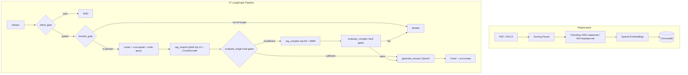

# Regulatory Compliance RAG

**Продакшн RAG-пайплайн для российских нормативных документов (ГОСТ, СНиП, ТК РФ) — отвечает на вопросы с указанием источника или явно отказывается от ответа при недостаточной уверенности.**

[](https://python.org)
[](https://github.com/spqr-86/regulatory-rag/actions/workflows/ci.yml)
[](https://opensource.org/licenses/MIT)

**In-scope correctness: 7.4/10 · Faithfulness: 0.86 · OOS abstain: 1.00 · Стоимость: $0.01/запрос**

> Метрики из последнего eval (судья `gpt-4o`). Архитектурные решения описаны в [docs/explanation/design-decisions.md](./docs/explanation/design-decisions.md).

[English README →](./README.md)

---

## Проблема

Нормативные документы в промышленных отраслях (охрана труда, водоснабжение, строительство) — это сотни PDF с перекрёстными ссылками. Ручной поиск медленный и ненадёжный. Галлюцинированный ответ на вопрос по нормативам — это не UX-проблема, а прямой риск.

Проект исследует, насколько RAG + детерминированные guardrails решают задачу надёжного Q&A по нормативной базе.

---

## Как работает

```
Запрос пользователя
    ↓
intent_gate          — regex-фильтр, отсекает шум до retrieval
    ↓
domain_gate          — cosine-to-centroid OOS-фильтр, abstain до retrieval
    ↓
router               — план запроса + расширение глоссарием + multi-query (RRF-слияние)
    ↓
rag_simple           — гибридный retrieval (BM25 + векторы, top-12) + CrossEncoder rerank
    ↓
evaluate_triage      — детерминированные hard gates (без LLM-оценки)
    ├── sufficient    → generate_answer (OpenAI GPT-4o)
    └── insufficient  → rag_complex (top-60 + MMR) → evaluate_complex
                            ├── pass  → generate_answer
                            └── fail  → abstain (явный отказ)
```

Ключевые архитектурные решения:
- **Нет LLM-роутинга** — все ветвления используют детерминированные пороги по score
- **Abstain лучше галлюцинации** — система отказывается отвечать при низкой уверенности retrieval
- **Двухэтапный retrieval** — быстрый путь обрабатывает большинство запросов; медленный активируется только при необходимости

📖 **Документация:** [архитектура](./docs/explanation/architecture.md) · [проектные решения](./docs/explanation/design-decisions.md) · [полная документация](./docs/README.md)

---

## Метрики

| Метрика | Значение | Цель |
|---------|----------|------|
| In-scope correctness (LLM-as-judge, 0–10) | **7.44** | > 7.5 |
| Correctness, все вопросы | **7.39** | > 7.5 |
| Faithfulness (нет галлюцинаций, 0–1) | **0.859** | > 0.85 |
| Answer relevance (0–1) | **0.872** | > 0.85 |
| OOS abstain rate | **1.00** | > 0.90 |
| False-sufficiency rate | **0.098** | < 0.10 |
| Стоимость на запрос | **$0.0102** | — |
| Средняя задержка | **9.7s** | — |

Eval: 57-вопросный golden dataset (54 валидных), `eval/run_v7_eval.py`, судья `gpt-4o`
(`benchmarks/eval_v7_2026-05-30_chunkid.jsonl`). Числа зависят от судьи — текущий строже
предыдущих, поэтому абсолютные значения ниже, но лучше откалиброваны.
Канонические значения: [docs/reference/FACTS.md](./docs/reference/FACTS.md).

---

## Быстрый старт

```bash
git clone https://github.com/spqr-86/regulatory-rag.git
cd regulatory-rag
pip install -r requirements.txt
cp .env.example .env  # добавить OPENAI_API_KEY (LLM + embeddings)
```

Положите PDF/DOCX нормативных документов в `source_docs/`, затем:

```bash
python index.py        # индексировать документы → ChromaDB
streamlit run app.py   # UI на http://localhost:8501
uvicorn api:app --port 8503  # REST API на http://localhost:8503/docs
```

По умолчанию: Gemini + Chroma + OpenAI embeddings. Смотрите раздел [Замена бэкенда](#замена-бэкенда) для переключения через `.env`.

---

## Архитектура



### ГОСТ-корпус (отдельный индекс)

108 документов ГОСТ/СНиП → **9 344 чанка** в коллекции ChromaDB `wta_gosts` (пример корпуса, не входит в репо — используйте свои документы).
API-эндпоинт: `POST /query/gosts`. Генерация: DeepSeek V3.

---

## REST API

Запуск FastAPI-бэкенда вместе со Streamlit:

```bash
uvicorn api:app --port 8503
```

**`POST /query`** — основной RAG-пайплайн

```bash
curl -X POST http://localhost:8503/query \
  -H "Content-Type: application/json" \
  -d '{"question": "Как часто проводится повторный инструктаж?"}'
```

```json
{
  "answer": "Повторный инструктаж проводится не реже одного раза в 6 месяцев...",
  "passages": [{"text": "...", "source": "doc.pdf", "score": 0.91}],
  "path": "rag_simple",
  "elapsed_sec": 4.2
}
```

**`POST /query/gosts`** — поиск по корпусу ГОСТ/СНиП (отдельный индекс, DeepSeek V3)

```bash
curl -X POST http://localhost:8503/query/gosts \
  -H "Content-Type: application/json" \
  -d '{"question": "Степень защиты IP55 — что означает?"}'
```

**`GET /health`** — проверка готовности

```bash
curl http://localhost:8503/health
# {"status": "ok", "pipeline_ready": true, "gosts_ready": true}
```

Интерактивная документация: `http://localhost:8503/docs`

---

## Стек

| Слой | Технология |
|------|-----------|
| Оркестрация | LangGraph (V7 детерминированный граф) |
| LLM | Gemini, OpenAI, DeepSeek — настраивается через `SIMPLE/COMPLEX_LLM_PROVIDER` в `.env` |
| Embeddings | OpenAI text-embedding-3-small |
| Vector store | ChromaDB |
| Переранжирование | CrossEncoder (sentence-transformers); FlashRank выбирается через `RERANKER_BACKEND` |
| ETL | Docling (PDF/DOCX → чанки) |
| Оценка | Ragas + кастомный LLM-as-judge |
| UI | Streamlit |

---

## Замена бэкенда

LLM и vector store доступны через фабричные слои (`src/infra/llm_factory.py`, `src/backends/`). Добавление нового провайдера — один файл и одна запись в реестре, код пайплайна не меняется.

| Слой | Реализовано | Настройка через | Roadmap |
|------|-------------|-----------------|---------|
| LLM   | Gemini, OpenAI, DeepSeek | `LLM_PROVIDER` | Anthropic |
| Vector store | Chroma | `VECTOR_STORE` | Qdrant, pgvector |
| Embeddings | OpenAI, local (sentence-transformers), hf_api | `EMBEDDING_PROVIDER` | — |

**Полностью локальная установка** (без внешних API кроме LLM):
```bash
LLM_PROVIDER=gemini              # или любой другой поддерживаемый провайдер
VECTOR_STORE=chroma
EMBEDDING_PROVIDER=local
EMBEDDING_MODEL_NAME=ai-forever/sbert_large_nlu_ru
```

**Добавление нового LLM-провайдера** (пример: Anthropic):
1. Добавить `_create_anthropic_llm(**kwargs)` в `src/llm_factory.py`
2. Зарегистрировать в `_LLM_PROVIDERS = {..., "anthropic": _create_anthropic_llm}`
3. Установить `LLM_PROVIDER=anthropic` в `.env`

Аналогичная схема для vector store — реализовать протокол `VectorStoreBackend` в `src/backends/`, зарегистрировать в фабрике. Архитектурное обоснование: `docs/plans/2026-05-23-pluggable-backends.md`.

---

## Адаптация под свой домен

Система настроена под российские нормативные документы, но доменные знания изолированы и легко заменяются.

**Глоссарий терминов** (`config/term_glossary.yaml`) — маппинг неформальных аббревиатур на официальные полные названия, чтобы BM25 и векторный поиск находили проиндексированный текст. Поставляется с терминами охраны труда (ТК РФ, Постановление 2464 и т.д.). Расширение:

```yaml
terms:
  "ваша аббревиатура":
    official: "Полное официальное название из ваших документов"
    source: "Ссылка на норматив (необязательно)"
```

Изменений в коде не нужно — правьте YAML и перезапускайте.

**Промпты** (`prompts/`) — Jinja2-шаблоны, версионированные. Переключение активной версии через env-переменную или `prompts/registry.yaml`.

**Корпус** — положите PDF в `source_docs/` и запустите `python index.py`. Чанкер и embeddings языконезависимы (OpenAI `text-embedding-3-small`).

---

## Статус проекта

- ✅ V7 LangGraph-пайплайн — все ноды, детерминированный роутинг (verifier/rewriter убраны — insufficient triage ведёт сразу в rag_complex)
- ✅ Гибридный retrieval — BM25 + семантический, двухэтапный (simple/complex path)
- ✅ Hard gate пороги — по score, без LLM в роутинге
- ✅ Domain gate — pre-retrieval OOS-фильтр через cosine similarity к центроиду корпуса
- ✅ HybridChunker v3 — структурно-ориентированный чанкинг по разделам/статьям документов
- ✅ Контекстное embedding — заголовок родительского раздела добавляется к вектору чанка (лёгкий Contextual Retrieval)
- ✅ Раскрытие перекрёстных ссылок — автоматически подтягивает упомянутые пункты (напр., «пункт 46») из того же источника
- ✅ Multi-query расширение — LLM генерирует варианты запроса, слияние через RRF
- ✅ Версионированные промпты — Jinja2-шаблоны, реестр сокращён до 3 активных семейств; `generate_answer` v8 (anti-sycophancy + value↔condition)
- ✅ Eval framework — golden dataset, in-scope correctness 7.4/10, faithfulness 0.86
- ✅ ГОСТ RAG — 108 документов, 9 344 чанка, отдельная коллекция ChromaDB
- ✅ Задеплоен на VPS (порт 8502, Streamlit)
- 🔄 Устойчивость value↔condition на запросах с несколькими значениями (например, периодичность по типу программы)
- 🔄 Расширение корпуса (методика СОУТ, детали пожарной безопасности)

---

**Автор:** Пётр Балдаев — [LinkedIn](https://linkedin.com/in/petr-baldaev-b1252b263/) · [GitHub](https://github.com/spqr-86)

[Changelog →](./CHANGELOG.md)
